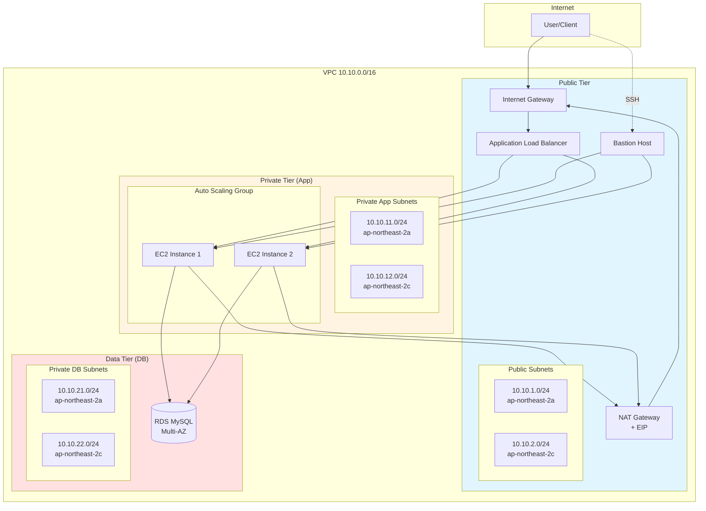

# Design: Infrastructure Expansion (인프라 확장)

**작성일**: 2026-01-30
**작성자**: Claude Code
**Feature ID**: infrastructure-expansion
**PDCA Phase**: Design
**Based on**: [20260130-infrastructure-expansion.plan.md](../../01-plan/features/20260130-infrastructure-expansion.plan.md)

---

## 1. 아키텍처 설계

### 1.1 전체 아키텍처 다이어그램



### 1.2 네트워크 구성 상세

#### CIDR 블록 할당
```
VPC: 10.10.0.0/16 (65,536 IPs)

Public Subnets (기존):
  - 10.10.1.0/24  (ap-northeast-2a) - 251 usable IPs
  - 10.10.2.0/24  (ap-northeast-2c) - 251 usable IPs

Private App Subnets (신규):
  - 10.10.11.0/24 (ap-northeast-2a) - 251 usable IPs
  - 10.10.12.0/24 (ap-northeast-2c) - 251 usable IPs

Private DB Subnets (신규):
  - 10.10.21.0/24 (ap-northeast-2a) - 251 usable IPs
  - 10.10.22.0/24 (ap-northeast-2c) - 251 usable IPs

Reserved for Future:
  - 10.10.3-10.x.x   (예비 Public)
  - 10.10.13-20.x.x  (예비 Private App)
  - 10.10.22-30.x.x  (예비 Private DB)
```

#### Route Tables
```
Public Route Table (기존):
  - 0.0.0.0/0 → Internet Gateway
  - Associated: Public Subnets

Private Route Table (신규):
  - 0.0.0.0/0 → NAT Gateway
  - 10.10.0.0/16 → local
  - Associated: Private App Subnets, Private DB Subnets
```

---

## 2. 리소스 상세 설계

### 2.1 NAT Gateway & EIP

**파일**: `network-private.tf`

```hcl
# Elastic IP for NAT Gateway
resource "aws_eip" "nat" {
  domain = "vpc"

  tags = {
    Name = "${var.project_name}-${var.env_name}-nat-eip"
  }

  # NAT Gateway가 먼저 삭제되도록 의존성 설정
  depends_on = [aws_internet_gateway.igw]
}

# NAT Gateway
# - Public Subnet에 배치 (외부 통신 필요)
# - 단일 NAT Gateway (비용 절감, 학습용)
# - 운영 환경: Multi-AZ NAT Gateway 권장
resource "aws_nat_gateway" "main" {
  allocation_id = aws_eip.nat.id
  subnet_id     = aws_subnet.public[0].id  # 첫 번째 Public Subnet

  tags = {
    Name = "${var.project_name}-${var.env_name}-nat-gw"
  }

  depends_on = [aws_internet_gateway.igw]
}
```

**설계 결정**:
- 단일 NAT Gateway (학습용, 비용 절감)
- 운영 환경에서는 각 AZ에 NAT Gateway 배치 권장
- EIP는 NAT Gateway에 연결

---

### 2.2 Private Subnets

**파일**: `network-private.tf`

```hcl
# Private Application Subnets
# - EC2 인스턴스가 배치될 서브넷
# - NAT Gateway를 통해 외부 통신
resource "aws_subnet" "private_app" {
  count                   = length(var.private_app_subnet_cidrs)
  vpc_id                  = aws_vpc.main.id
  cidr_block              = var.private_app_subnet_cidrs[count.index]
  availability_zone       = var.azs[count.index]
  map_public_ip_on_launch = false  # Private이므로 Public IP 할당 안 함

  tags = {
    Name = "${var.project_name}-${var.env_name}-private-app-subnet-${count.index + 1}"
    Tier = "Application"
  }
}

# Private Database Subnets
# - RDS 인스턴스가 배치될 서브넷
# - 외부 통신 불필요 (앱 계층에서만 접근)
resource "aws_subnet" "private_db" {
  count                   = length(var.private_db_subnet_cidrs)
  vpc_id                  = aws_vpc.main.id
  cidr_block              = var.private_db_subnet_cidrs[count.index]
  availability_zone       = var.azs[count.index]
  map_public_ip_on_launch = false

  tags = {
    Name = "${var.project_name}-${var.env_name}-private-db-subnet-${count.index + 1}"
    Tier = "Database"
  }
}

# Private Route Table
resource "aws_route_table" "private" {
  vpc_id = aws_vpc.main.id

  tags = {
    Name = "${var.project_name}-${var.env_name}-private-rt"
  }
}

# Private Route (0.0.0.0/0 → NAT Gateway)
resource "aws_route" "private_nat" {
  route_table_id         = aws_route_table.private.id
  destination_cidr_block = "0.0.0.0/0"
  nat_gateway_id         = aws_nat_gateway.main.id
}

# Private App Subnet → Private Route Table
resource "aws_route_table_association" "private_app" {
  count          = length(aws_subnet.private_app)
  subnet_id      = aws_subnet.private_app[count.index].id
  route_table_id = aws_route_table.private.id
}

# Private DB Subnet → Private Route Table
resource "aws_route_table_association" "private_db" {
  count          = length(aws_subnet.private_db)
  subnet_id      = aws_subnet.private_db[count.index].id
  route_table_id = aws_route_table.private.id
}
```

---

### 2.3 Security Groups

**파일**: `security-groups.tf` (신규)

```hcl
# ALB Security Group
# - 인터넷에서 HTTP/HTTPS 접근 허용
resource "aws_security_group" "alb" {
  name        = "${var.project_name}-${var.env_name}-alb-sg"
  description = "Security group for Application Load Balancer"
  vpc_id      = aws_vpc.main.id

  # HTTP 인바운드
  ingress {
    description = "HTTP from Internet"
    from_port   = 80
    to_port     = 80
    protocol    = "tcp"
    cidr_blocks = ["0.0.0.0/0"]
  }

  # HTTPS 인바운드 (선택)
  ingress {
    description = "HTTPS from Internet"
    from_port   = 443
    to_port     = 443
    protocol    = "tcp"
    cidr_blocks = ["0.0.0.0/0"]
  }

  # 아웃바운드: EC2로 포워딩
  egress {
    description = "To EC2 instances"
    from_port   = 0
    to_port     = 0
    protocol    = "-1"
    cidr_blocks = ["0.0.0.0/0"]
  }

  tags = {
    Name = "${var.project_name}-${var.env_name}-alb-sg"
  }
}

# Bastion Security Group
# - 관리자 IP에서만 SSH 접근 허용
resource "aws_security_group" "bastion" {
  name        = "${var.project_name}-${var.env_name}-bastion-sg"
  description = "Security group for Bastion Host"
  vpc_id      = aws_vpc.main.id

  # SSH 인바운드 (관리자 IP로 제한 권장)
  ingress {
    description = "SSH from Admin"
    from_port   = 22
    to_port     = 22
    protocol    = "tcp"
    cidr_blocks = var.admin_ssh_cidrs  # 변수로 관리
  }

  egress {
    description = "All outbound"
    from_port   = 0
    to_port     = 0
    protocol    = "-1"
    cidr_blocks = ["0.0.0.0/0"]
  }

  tags = {
    Name = "${var.project_name}-${var.env_name}-bastion-sg"
  }
}

# Application (EC2) Security Group
# - ALB에서 HTTP 허용
# - Bastion에서 SSH 허용
resource "aws_security_group" "app" {
  name        = "${var.project_name}-${var.env_name}-app-sg"
  description = "Security group for Application EC2 instances"
  vpc_id      = aws_vpc.main.id

  # HTTP from ALB
  ingress {
    description     = "HTTP from ALB"
    from_port       = 80
    to_port         = 80
    protocol        = "tcp"
    security_groups = [aws_security_group.alb.id]
  }

  # SSH from Bastion
  ingress {
    description     = "SSH from Bastion"
    from_port       = 22
    to_port         = 22
    protocol        = "tcp"
    security_groups = [aws_security_group.bastion.id]
  }

  # 외부 통신 (패키지 설치 등)
  egress {
    description = "All outbound"
    from_port   = 0
    to_port     = 0
    protocol    = "-1"
    cidr_blocks = ["0.0.0.0/0"]
  }

  tags = {
    Name = "${var.project_name}-${var.env_name}-app-sg"
  }
}

# Database Security Group
# - App SG에서만 MySQL 포트 접근 허용
resource "aws_security_group" "db" {
  name        = "${var.project_name}-${var.env_name}-db-sg"
  description = "Security group for RDS Database"
  vpc_id      = aws_vpc.main.id

  # MySQL from App instances
  ingress {
    description     = "MySQL from App"
    from_port       = 3306
    to_port         = 3306
    protocol        = "tcp"
    security_groups = [aws_security_group.app.id]
  }

  # PostgreSQL (선택)
  # ingress {
  #   description     = "PostgreSQL from App"
  #   from_port       = 5432
  #   to_port         = 5432
  #   protocol        = "tcp"
  #   security_groups = [aws_security_group.app.id]
  # }

  # DB는 아웃바운드 불필요 (제한)
  egress {
    description = "No outbound required"
    from_port   = 0
    to_port     = 0
    protocol    = "-1"
    cidr_blocks = []
  }

  tags = {
    Name = "${var.project_name}-${var.env_name}-db-sg"
  }
}
```

**보안 설계 원칙**:
1. **최소 권한**: 필요한 포트만 오픈
2. **계층 분리**: SG 간 참조로 계층 간 접근 제어
3. **소스 제한**: CIDR 대신 SG 참조 우선
4. **관리자 접근**: Bastion을 통한 우회 접근

---

### 2.4 EC2 & Auto Scaling

**파일**: `compute.tf` (신규)

```hcl
# SSH Key Pair (기존에 없다면 생성)
# 주의: 실제로는 AWS Console이나 aws cli로 미리 생성 권장
# resource "aws_key_pair" "main" {
#   key_name   = "${var.project_name}-${var.env_name}-key"
#   public_key = file("~/.ssh/id_rsa.pub")  # 실제 경로로 변경
# }

# Launch Template
# - EC2 인스턴스 템플릿 정의
# - User Data로 웹 서버 자동 설치
resource "aws_launch_template" "app" {
  name_prefix   = "${var.project_name}-${var.env_name}-app-"
  image_id      = var.ami_id  # Amazon Linux 2 AMI
  instance_type = var.instance_type

  # key_name = aws_key_pair.main.key_name

  network_interfaces {
    associate_public_ip_address = false
    security_groups             = [aws_security_group.app.id]
    delete_on_termination       = true
  }

  # User Data - 웹 서버 설치
  user_data = base64encode(<<-EOF
    #!/bin/bash
    yum update -y
    yum install -y httpd
    systemctl start httpd
    systemctl enable httpd

    # 인스턴스 정보를 보여주는 간단한 페이지
    INSTANCE_ID=$(ec2-metadata --instance-id | cut -d " " -f 2)
    AZ=$(ec2-metadata --availability-zone | cut -d " " -f 2)

    cat <<HTML > /var/www/html/index.html
    <!DOCTYPE html>
    <html>
    <head><title>TF Lab App</title></head>
    <body>
      <h1>Hello from Terraform Lab!</h1>
      <p>Instance ID: $INSTANCE_ID</p>
      <p>Availability Zone: $AZ</p>
    </body>
    </html>
    HTML
  EOF
  )

  tag_specifications {
    resource_type = "instance"
    tags = {
      Name = "${var.project_name}-${var.env_name}-app-instance"
    }
  }

  lifecycle {
    create_before_destroy = true
  }
}

# Auto Scaling Group
resource "aws_autoscaling_group" "app" {
  name                = "${var.project_name}-${var.env_name}-asg"
  vpc_zone_identifier = aws_subnet.private_app[*].id
  target_group_arns   = [aws_lb_target_group.app.arn]
  health_check_type   = "ELB"
  health_check_grace_period = 300

  min_size         = var.asg_min_size
  max_size         = var.asg_max_size
  desired_capacity = var.asg_desired_capacity

  launch_template {
    id      = aws_launch_template.app.id
    version = "$Latest"
  }

  tag {
    key                 = "Name"
    value               = "${var.project_name}-${var.env_name}-asg-instance"
    propagate_at_launch = true
  }

  lifecycle {
    create_before_destroy = true
  }
}

# Bastion Host (Public Subnet)
# LocalStack에서는 실제 EC2 생성이 제한적이므로 주석 처리 가능
resource "aws_instance" "bastion" {
  ami           = var.ami_id
  instance_type = "t3.micro"
  subnet_id     = aws_subnet.public[0].id

  vpc_security_group_ids = [aws_security_group.bastion.id]

  # key_name = aws_key_pair.main.key_name

  tags = {
    Name = "${var.project_name}-${var.env_name}-bastion"
  }
}
```

---

### 2.5 Application Load Balancer

**파일**: `loadbalancer.tf` (신규)

```hcl
# Application Load Balancer
resource "aws_lb" "main" {
  name               = "${var.project_name}-${var.env_name}-alb"
  internal           = false
  load_balancer_type = "application"
  security_groups    = [aws_security_group.alb.id]
  subnets            = aws_subnet.public[*].id

  enable_deletion_protection = false  # 학습용이므로 false

  tags = {
    Name = "${var.project_name}-${var.env_name}-alb"
  }
}

# Target Group
resource "aws_lb_target_group" "app" {
  name     = "${var.project_name}-${var.env_name}-tg"
  port     = 80
  protocol = "HTTP"
  vpc_id   = aws_vpc.main.id

  health_check {
    enabled             = true
    healthy_threshold   = 2
    unhealthy_threshold = 2
    timeout             = 5
    interval            = 30
    path                = "/"
    matcher             = "200"
  }

  tags = {
    Name = "${var.project_name}-${var.env_name}-tg"
  }
}

# Listener (HTTP)
resource "aws_lb_listener" "http" {
  load_balancer_arn = aws_lb.main.arn
  port              = 80
  protocol          = "HTTP"

  default_action {
    type             = "forward"
    target_group_arn = aws_lb_target_group.app.arn
  }
}

# HTTPS Listener (선택, 인증서 필요)
# resource "aws_lb_listener" "https" {
#   load_balancer_arn = aws_lb.main.arn
#   port              = 443
#   protocol          = "HTTPS"
#   ssl_policy        = "ELBSecurityPolicy-2016-08"
#   certificate_arn   = var.ssl_certificate_arn
#
#   default_action {
#     type             = "forward"
#     target_group_arn = aws_lb_target_group.app.arn
#   }
# }
```

---

### 2.6 RDS Database

**파일**: `database.tf` (신규)

```hcl
# DB Subnet Group
# - RDS는 최소 2개 AZ의 서브넷 필요
resource "aws_db_subnet_group" "main" {
  name       = "${var.project_name}-${var.env_name}-db-subnet-group"
  subnet_ids = aws_subnet.private_db[*].id

  tags = {
    Name = "${var.project_name}-${var.env_name}-db-subnet-group"
  }
}

# DB Parameter Group (선택)
resource "aws_db_parameter_group" "main" {
  name   = "${var.project_name}-${var.env_name}-db-params"
  family = "mysql8.0"  # MySQL 8.0

  parameter {
    name  = "character_set_server"
    value = "utf8mb4"
  }

  parameter {
    name  = "collation_server"
    value = "utf8mb4_unicode_ci"
  }

  tags = {
    Name = "${var.project_name}-${var.env_name}-db-params"
  }
}

# RDS Instance
resource "aws_db_instance" "main" {
  identifier = "${var.project_name}-${var.env_name}-db"

  engine               = var.db_engine         # mysql
  engine_version       = var.db_engine_version # 8.0.35
  instance_class       = var.db_instance_class # db.t3.micro
  allocated_storage    = 20
  storage_type         = "gp3"
  storage_encrypted    = false  # LocalStack 제약

  db_name  = var.db_name
  username = var.db_username
  password = var.db_password  # tfvars로 관리, Secrets Manager 권장

  db_subnet_group_name   = aws_db_subnet_group.main.name
  vpc_security_group_ids = [aws_security_group.db.id]
  parameter_group_name   = aws_db_parameter_group.main.name

  # Multi-AZ 설정
  multi_az = var.db_multi_az  # true for HA

  # 백업 설정
  backup_retention_period = 7
  backup_window           = "03:00-04:00"  # UTC
  maintenance_window      = "mon:04:00-mon:05:00"

  # 스냅샷 관리
  skip_final_snapshot       = true  # 학습용이므로 true
  final_snapshot_identifier = "${var.project_name}-${var.env_name}-final-snapshot"

  # 삭제 방지 (운영에서는 true)
  deletion_protection = false

  # Public 접근 차단
  publicly_accessible = false

  tags = {
    Name = "${var.project_name}-${var.env_name}-rds"
  }
}
```

**보안 고려사항**:
- 패스워드는 Secrets Manager 사용 권장
- 백업 자동화 (7일 보관)
- Multi-AZ로 고가용성 확보
- Public 접근 차단

---

## 3. 변수 정의

### 3.1 variables.tf 추가 내용

```hcl
# ============================================
# 신규 변수 (Infrastructure Expansion)
# ============================================

# Private App Subnet CIDR
variable "private_app_subnet_cidrs" {
  description = "Private application subnet CIDR blocks"
  type        = list(string)
}

# Private DB Subnet CIDR
variable "private_db_subnet_cidrs" {
  description = "Private database subnet CIDR blocks"
  type        = list(string)
}

# Admin SSH 허용 CIDR
variable "admin_ssh_cidrs" {
  description = "CIDR blocks allowed to SSH to Bastion"
  type        = list(string)
  default     = ["0.0.0.0/0"]  # 학습용, 운영에서는 제한 필수
}

# AMI ID
variable "ami_id" {
  description = "AMI ID for EC2 instances"
  type        = string
  # Amazon Linux 2 AMI (ap-northeast-2)
  # 실제 AWS: ami-0c9c942bd7bf113a2
  # LocalStack: ami-12345678 (더미)
  default = "ami-12345678"
}

# EC2 Instance Type
variable "instance_type" {
  description = "EC2 instance type"
  type        = string
  default     = "t3.micro"
}

# Auto Scaling 설정
variable "asg_min_size" {
  description = "Minimum number of EC2 instances"
  type        = number
  default     = 2
}

variable "asg_max_size" {
  description = "Maximum number of EC2 instances"
  type        = number
  default     = 4
}

variable "asg_desired_capacity" {
  description = "Desired number of EC2 instances"
  type        = number
  default     = 2
}

# RDS 설정
variable "db_engine" {
  description = "Database engine (mysql/postgres)"
  type        = string
  default     = "mysql"
}

variable "db_engine_version" {
  description = "Database engine version"
  type        = string
  default     = "8.0.35"
}

variable "db_instance_class" {
  description = "RDS instance class"
  type        = string
  default     = "db.t3.micro"
}

variable "db_name" {
  description = "Database name"
  type        = string
  default     = "tflab"
}

variable "db_username" {
  description = "Database master username"
  type        = string
  default     = "admin"
  sensitive   = true
}

variable "db_password" {
  description = "Database master password"
  type        = string
  sensitive   = true
}

variable "db_multi_az" {
  description = "Enable Multi-AZ for RDS"
  type        = bool
  default     = false  # 학습용 false, 운영 true
}
```

---

### 3.2 env/local/terraform.tfvars 추가 내용

```hcl
# ============================================
# Infrastructure Expansion 변수값
# ============================================

# Private Subnets
private_app_subnet_cidrs = [
  "10.10.11.0/24",
  "10.10.12.0/24",
]

private_db_subnet_cidrs = [
  "10.10.21.0/24",
  "10.10.22.0/24",
]

# SSH Access (학습용 전체 오픈, 운영에서는 제한)
admin_ssh_cidrs = ["0.0.0.0/0"]

# EC2 설정
ami_id        = "ami-12345678"  # LocalStack 더미 AMI
instance_type = "t3.micro"

# Auto Scaling
asg_min_size         = 2
asg_max_size         = 4
asg_desired_capacity = 2

# RDS 설정
db_engine         = "mysql"
db_engine_version = "8.0.35"
db_instance_class = "db.t3.micro"
db_name           = "tflab"
db_username       = "admin"
db_password       = "changeme123!"  # 운영: Secrets Manager 사용
db_multi_az       = false           # LocalStack에서는 false
```

---

## 4. Outputs 정의

### 4.1 outputs.tf 추가 내용

```hcl
# ============================================
# Infrastructure Expansion Outputs
# ============================================

# NAT Gateway
output "nat_gateway_id" {
  description = "NAT Gateway ID"
  value       = aws_nat_gateway.main.id
}

output "nat_eip" {
  description = "NAT Gateway Elastic IP"
  value       = aws_eip.nat.public_ip
}

# Private Subnets
output "private_app_subnet_ids" {
  description = "Private Application Subnet IDs"
  value       = aws_subnet.private_app[*].id
}

output "private_db_subnet_ids" {
  description = "Private Database Subnet IDs"
  value       = aws_subnet.private_db[*].id
}

# Load Balancer
output "alb_dns_name" {
  description = "ALB DNS name"
  value       = aws_lb.main.dns_name
}

output "alb_arn" {
  description = "ALB ARN"
  value       = aws_lb.main.arn
}

# Auto Scaling Group
output "asg_name" {
  description = "Auto Scaling Group name"
  value       = aws_autoscaling_group.app.name
}

# Bastion
output "bastion_public_ip" {
  description = "Bastion Host Public IP"
  value       = aws_instance.bastion.public_ip
}

# RDS
output "rds_endpoint" {
  description = "RDS endpoint"
  value       = aws_db_instance.main.endpoint
  sensitive   = true
}

output "rds_arn" {
  description = "RDS ARN"
  value       = aws_db_instance.main.arn
}

# Security Groups
output "alb_sg_id" {
  value = aws_security_group.alb.id
}

output "bastion_sg_id" {
  value = aws_security_group.bastion.id
}

output "app_sg_id" {
  value = aws_security_group.app.id
}

output "db_sg_id" {
  value = aws_security_group.db.id
}
```

---

## 5. 파일 구조 최종

```
tf-lab/
├── main.tf                        # VPC, Public Subnet, IGW (기존)
├── network-private.tf             # (신규) Private Subnet, NAT, Route Table
├── security-groups.tf             # (신규) 모든 Security Groups
├── compute.tf                     # (신규) EC2, ASG, Launch Template, Bastion
├── loadbalancer.tf                # (신규) ALB, Target Group, Listener
├── database.tf                    # (신규) RDS, DB Subnet Group
├── backend.tf                     # (기존) S3 Backend
├── providers.localstack.tf        # (기존) AWS Provider
├── variables.tf                   # (수정) 기존 + 신규 변수
├── outputs.tf                     # (수정) 기존 + 신규 outputs
├── versions.tf                    # (기존) 버전 요구사항
│
├── env/
│   └── local/
│       ├── backend.hcl            # (기존) Backend 설정
│       └── terraform.tfvars       # (수정) 기존 + 신규 변수값
│
├── scripts/
│   └── set-localstack-env.ps1     # (기존) 환경변수 설정
│
└── docs/
    ├── 01-plan/
    │   └── features/
    │       └── 20260130-infrastructure-expansion.plan.md
    ├── 02-design/
    │   └── features/
    │       └── 20260130-infrastructure-expansion.design.md  (현재)
    └── terraform-commands.md      # (업데이트 필요)
```

---

## 6. 구현 순서

### Phase 1: 네트워크 확장 (필수)
1. `network-private.tf` 작성
   - EIP, NAT Gateway
   - Private Subnets (App, DB)
   - Private Route Table
2. `variables.tf` 업데이트
3. `env/local/terraform.tfvars` 업데이트
4. 테스트: `terraform plan`

### Phase 2: Security Groups (필수)
1. `security-groups.tf` 작성
   - ALB SG, Bastion SG, App SG, DB SG
2. 기존 `main.tf`의 web SG 제거 또는 통합
3. 테스트: `terraform plan`

### Phase 3: 컴퓨팅 리소스 (필수)
1. `compute.tf` 작성
   - Launch Template, ASG, Bastion
2. User Data 스크립트 작성
3. 테스트: `terraform plan`

### Phase 4: Load Balancer (권장)
1. `loadbalancer.tf` 작성
   - ALB, Target Group, Listener
2. 테스트: `terraform plan`

### Phase 5: 데이터베이스 (선택)
1. `database.tf` 작성
   - DB Subnet Group, RDS Instance
2. 민감 정보 관리 (password)
3. 테스트: `terraform plan`

### Phase 6: Outputs & 문서화
1. `outputs.tf` 업데이트
2. `terraform-commands.md` 업데이트
3. 아키텍처 다이어그램 작성

---

## 7. LocalStack 제약사항 대응

| 리소스 | 제약사항 | 대응 방안 |
|--------|---------|----------|
| NAT Gateway | Mock 지원 | 생성은 되지만 실제 라우팅은 제한적 |
| EC2 | 제한적 | 인스턴스 생성은 되지만 SSH 접속 불가능 |
| ALB | 제한적 | 생성 가능, Health Check는 간소화 |
| RDS | 제한적 | 메타데이터만 저장, 실제 DB 엔진 X |
| Auto Scaling | Mock | 인스턴스 생성되지만 스케일링 이벤트 X |

**학습 포커스**:
- Terraform 코드 작성 및 리소스 정의
- 아키텍처 설계 및 보안 그룹 설계
- 실제 AWS 배포 시 참고 자료

---

## 8. 검증 계획

### 8.1 코드 검증
```bash
terraform fmt -recursive
terraform validate
```

### 8.2 Plan 검증
```bash
terraform plan -var-file=env/local/terraform.tfvars
```

### 8.3 리소스 생성 확인
```bash
terraform apply -var-file=env/local/terraform.tfvars
terraform output
```

### 8.4 LocalStack 리소스 확인
```bash
# VPC
aws --endpoint-url=http://localhost:4566 ec2 describe-vpcs

# Subnets
aws --endpoint-url=http://localhost:4566 ec2 describe-subnets

# NAT Gateway
aws --endpoint-url=http://localhost:4566 ec2 describe-nat-gateways

# Security Groups
aws --endpoint-url=http://localhost:4566 ec2 describe-security-groups
```

---

## 9. 다음 단계

1. **구현 (Do)**
   - Phase별 순차 구현
   - 각 Phase마다 plan → apply → 검증

2. **Gap Analysis (Check)**
   - Design 문서와 실제 코드 비교
   - Match Rate 계산

3. **개선 (Act)**
   - Gap 해소
   - 코드 최적화

---

## 10. 참고 사항

### 10.1 보안 Best Practices
- [ ] DB 패스워드는 Secrets Manager 사용
- [ ] SSH 키는 버전 관리 제외 (.gitignore)
- [ ] Bastion SSH는 IP 제한
- [ ] Security Group은 최소 권한 원칙

### 10.2 비용 최적화 (실제 AWS)
- [ ] NAT Gateway → NAT Instance (비용 절감)
- [ ] RDS Multi-AZ는 필요시만 활성화
- [ ] EC2는 Reserved Instance 또는 Spot 고려
- [ ] ALB는 사용량 모니터링

### 10.3 운영 고려사항
- [ ] 백업 자동화 (RDS, S3)
- [ ] 모니터링 (CloudWatch)
- [ ] 로그 수집 (CloudWatch Logs)
- [ ] 알람 설정 (SNS)

---

**Design 작성 완료**: 2026-01-30
**다음 단계**: 구현 (`/pdca do infrastructure-expansion`)
