# Design: Infrastructure Modulization (인프라 모듈화)

**작성일**: 2026-01-30
**작성자**: Claude Code
**Feature ID**: infrastructure-modulization
**PDCA Phase**: Design
**Based on**: [20260130-infrastructure-modulization.plan.md](../../01-plan/features/20260130-infrastructure-modulization.plan.md)

---

## 1. 아키텍처 설계

### 1.1 모듈 구조 다이어그램

```mermaid
graph TB
    subgraph "environments/local/"
        Main[main.tf<br/>모듈 호출]
    end

    subgraph "Modules"
        VPC[VPC Module<br/>네트워크 기반]
        SG[Security Groups Module<br/>보안 그룹]
        Compute[Compute Module<br/>EC2, ASG, Bastion]
        ALB[ALB Module<br/>Load Balancer]
        RDS[RDS Module<br/>Database]
    end

    Main --> VPC
    Main --> SG
    Main --> Compute
    Main --> ALB
    Main --> RDS

    VPC -->|vpc_id, subnet_ids| SG
    VPC -->|vpc_id, subnet_ids| Compute
    VPC -->|vpc_id, subnet_ids| ALB
    VPC -->|vpc_id, subnet_ids| RDS

    SG -->|sg_ids| Compute
    SG -->|alb_sg_id| ALB
    SG -->|db_sg_id| RDS

    ALB -->|target_group_arn| Compute

    style VPC fill:#e1f5ff
    style SG fill:#fff4e1
    style Compute fill:#ffe1e1
    style ALB fill:#e1ffe1
    style RDS fill:#f0e1ff
```



### 1.2 최종 디렉토리 구조

```
tf-lab/
├── modules/                              # 재사용 가능한 모듈
│   ├── vpc/
│   │   ├── main.tf
│   │   ├── variables.tf
│   │   ├── outputs.tf
│   │   └── README.md
│   ├── security-groups/
│   │   ├── main.tf
│   │   ├── variables.tf
│   │   ├── outputs.tf
│   │   └── README.md
│   ├── compute/
│   │   ├── main.tf
│   │   ├── variables.tf
│   │   ├── outputs.tf
│   │   └── README.md
│   ├── alb/
│   │   ├── main.tf
│   │   ├── variables.tf
│   │   ├── outputs.tf
│   │   └── README.md
│   └── rds/
│       ├── main.tf
│       ├── variables.tf
│       ├── outputs.tf
│       └── README.md
│
├── environments/
│   └── local/
│       ├── main.tf                       # 모듈 호출
│       ├── variables.tf                  # 환경 변수
│       ├── outputs.tf                    # 환경 출력
│       ├── backend.tf                    # Backend 설정
│       ├── providers.tf                  # Provider 설정
│       ├── versions.tf                   # 버전 요구사항
│       ├── backend.hcl                   # Backend 구체 설정
│       └── terraform.tfvars              # 변수 값
│
├── docs/                                 # 문서 (기존)
└── (기존 파일들은 environments/local로 통합 또는 삭제)
```

---

## 2. 모듈 상세 설계

### 2.1 VPC 모듈 (`modules/vpc/`)

#### 2.1.1 목적
VPC 네트워크 기반 인프라 제공:
- VPC, IGW, NAT Gateway
- Public/Private Subnets (Multi-AZ)
- Route Tables 및 연결

#### 2.1.2 파일: `main.tf`

```hcl
# VPC
resource "aws_vpc" "main" {
  cidr_block           = var.vpc_cidr
  enable_dns_hostnames = true
  enable_dns_support   = true

  tags = {
    Name = "${var.project_name}-${var.env_name}-vpc"
  }
}

# Internet Gateway
resource "aws_internet_gateway" "igw" {
  vpc_id = aws_vpc.main.id

  tags = {
    Name = "${var.project_name}-${var.env_name}-igw"
  }
}

# Elastic IP for NAT Gateway
resource "aws_eip" "nat" {
  domain     = "vpc"
  depends_on = [aws_internet_gateway.igw]

  tags = {
    Name = "${var.project_name}-${var.env_name}-nat-eip"
  }
}

# NAT Gateway
resource "aws_nat_gateway" "main" {
  allocation_id = aws_eip.nat.id
  subnet_id     = aws_subnet.public[0].id
  depends_on    = [aws_internet_gateway.igw]

  tags = {
    Name = "${var.project_name}-${var.env_name}-nat-gw"
  }
}

# Public Subnets
resource "aws_subnet" "public" {
  count                   = length(var.public_subnet_cidrs)
  vpc_id                  = aws_vpc.main.id
  cidr_block              = var.public_subnet_cidrs[count.index]
  availability_zone       = var.azs[count.index]
  map_public_ip_on_launch = true

  tags = {
    Name = "${var.project_name}-${var.env_name}-public-subnet-${count.index + 1}"
  }
}

# Private App Subnets
resource "aws_subnet" "private_app" {
  count                   = length(var.private_app_subnet_cidrs)
  vpc_id                  = aws_vpc.main.id
  cidr_block              = var.private_app_subnet_cidrs[count.index]
  availability_zone       = var.azs[count.index]
  map_public_ip_on_launch = false

  tags = {
    Name = "${var.project_name}-${var.env_name}-private-app-subnet-${count.index + 1}"
    Tier = "Application"
  }
}

# Private DB Subnets
resource "aws_subnet" "private_db" {
  count                   = length(var.private_db_subnet_cidrs)
  vpc_id                  = aws_vpc.main.id
  cidr_block              = var.private_db_subnet_cidrs[count.index]
  availability_zone       = var.azs[count.index]
  map_public_ip_on_launch = false

  tags = {
    Name = "${var.project_name}-${var.env_name}-private-db-subnet-${count.index + 1}"
    Tier = "Database"
  }
}

# Public Route Table
resource "aws_route_table" "public" {
  vpc_id = aws_vpc.main.id

  tags = {
    Name = "${var.project_name}-${var.env_name}-public-rt"
  }
}

# Public Route
resource "aws_route" "public_internet" {
  route_table_id         = aws_route_table.public.id
  destination_cidr_block = "0.0.0.0/0"
  gateway_id             = aws_internet_gateway.igw.id
}

# Public Subnet Associations
resource "aws_route_table_association" "public" {
  count          = length(aws_subnet.public)
  subnet_id      = aws_subnet.public[count.index].id
  route_table_id = aws_route_table.public.id
}

# Private Route Table
resource "aws_route_table" "private" {
  vpc_id = aws_vpc.main.id

  tags = {
    Name = "${var.project_name}-${var.env_name}-private-rt"
  }
}

# Private Route
resource "aws_route" "private_nat" {
  route_table_id         = aws_route_table.private.id
  destination_cidr_block = "0.0.0.0/0"
  nat_gateway_id         = aws_nat_gateway.main.id
}

# Private App Subnet Associations
resource "aws_route_table_association" "private_app" {
  count          = length(aws_subnet.private_app)
  subnet_id      = aws_subnet.private_app[count.index].id
  route_table_id = aws_route_table.private.id
}

# Private DB Subnet Associations
resource "aws_route_table_association" "private_db" {
  count          = length(aws_subnet.private_db)
  subnet_id      = aws_subnet.private_db[count.index].id
  route_table_id = aws_route_table.private.id
}
```

#### 2.1.3 파일: `variables.tf`

```hcl
variable "project_name" {
  description = "Project name for resource tagging"
  type        = string
}

variable "env_name" {
  description = "Environment name (local/dev/prod)"
  type        = string
}

variable "vpc_cidr" {
  description = "VPC CIDR block"
  type        = string
}

variable "azs" {
  description = "Availability Zones"
  type        = list(string)
}

variable "public_subnet_cidrs" {
  description = "Public subnet CIDR blocks"
  type        = list(string)
}

variable "private_app_subnet_cidrs" {
  description = "Private application subnet CIDR blocks"
  type        = list(string)
}

variable "private_db_subnet_cidrs" {
  description = "Private database subnet CIDR blocks"
  type        = list(string)
}
```

#### 2.1.4 파일: `outputs.tf`

```hcl
output "vpc_id" {
  description = "VPC ID"
  value       = aws_vpc.main.id
}

output "vpc_cidr" {
  description = "VPC CIDR block"
  value       = aws_vpc.main.cidr_block
}

output "public_subnet_ids" {
  description = "Public subnet IDs"
  value       = aws_subnet.public[*].id
}

output "private_app_subnet_ids" {
  description = "Private application subnet IDs"
  value       = aws_subnet.private_app[*].id
}

output "private_db_subnet_ids" {
  description = "Private database subnet IDs"
  value       = aws_subnet.private_db[*].id
}

output "nat_gateway_id" {
  description = "NAT Gateway ID"
  value       = aws_nat_gateway.main.id
}

output "nat_eip" {
  description = "NAT Gateway Elastic IP"
  value       = aws_eip.nat.public_ip
}

output "internet_gateway_id" {
  description = "Internet Gateway ID"
  value       = aws_internet_gateway.igw.id
}
```

#### 2.1.5 파일: `README.md`

```markdown
# VPC Module

## 목적

AWS VPC 네트워크 인프라를 생성합니다:
- VPC with DNS support
- Internet Gateway
- NAT Gateway (single AZ)
- Public Subnets (Multi-AZ)
- Private App Subnets (Multi-AZ)
- Private DB Subnets (Multi-AZ)
- Route Tables

## 사용법

```hcl
module "vpc" {
  source = "../../modules/vpc"

  project_name             = "my-project"
  env_name                 = "local"
  vpc_cidr                 = "10.10.0.0/16"
  azs                      = ["ap-northeast-2a", "ap-northeast-2c"]
  public_subnet_cidrs      = ["10.10.1.0/24", "10.10.2.0/24"]
  private_app_subnet_cidrs = ["10.10.11.0/24", "10.10.12.0/24"]
  private_db_subnet_cidrs  = ["10.10.21.0/24", "10.10.22.0/24"]
}
```

## 입력 변수

| Name | Description | Type | Required |
|------|-------------|------|----------|
| project_name | Project name | string | Yes |
| env_name | Environment name | string | Yes |
| vpc_cidr | VPC CIDR block | string | Yes |
| azs | Availability Zones | list(string) | Yes |
| public_subnet_cidrs | Public subnet CIDRs | list(string) | Yes |
| private_app_subnet_cidrs | Private app subnet CIDRs | list(string) | Yes |
| private_db_subnet_cidrs | Private DB subnet CIDRs | list(string) | Yes |

## 출력

| Name | Description |
|------|-------------|
| vpc_id | VPC ID |
| public_subnet_ids | Public subnet IDs |
| private_app_subnet_ids | Private app subnet IDs |
| private_db_subnet_ids | Private DB subnet IDs |
| nat_gateway_id | NAT Gateway ID |
| nat_eip | NAT Gateway Elastic IP |

## 요구사항

- Terraform >= 1.5.0
- AWS Provider ~> 5.100
```

---

### 2.2 Security Groups 모듈 (`modules/security-groups/`)

#### 2.2.1 목적
계층별 Security Groups 제공:
- ALB, Bastion, App, DB Security Groups
- Security Group Rules

#### 2.2.2 파일: `main.tf`

```hcl
# ALB Security Group
resource "aws_security_group" "alb" {
  name        = "${var.project_name}-${var.env_name}-alb-sg"
  description = "Security group for Application Load Balancer"
  vpc_id      = var.vpc_id

  tags = {
    Name = "${var.project_name}-${var.env_name}-alb-sg"
  }
}

resource "aws_security_group_rule" "alb_ingress_http" {
  type              = "ingress"
  description       = "HTTP from Internet"
  from_port         = 80
  to_port           = 80
  protocol          = "tcp"
  cidr_blocks       = ["0.0.0.0/0"]
  security_group_id = aws_security_group.alb.id
}

resource "aws_security_group_rule" "alb_ingress_https" {
  type              = "ingress"
  description       = "HTTPS from Internet"
  from_port         = 443
  to_port           = 443
  protocol          = "tcp"
  cidr_blocks       = ["0.0.0.0/0"]
  security_group_id = aws_security_group.alb.id
}

resource "aws_security_group_rule" "alb_egress_all" {
  type              = "egress"
  description       = "To EC2 instances"
  from_port         = 0
  to_port           = 0
  protocol          = "-1"
  cidr_blocks       = ["0.0.0.0/0"]
  security_group_id = aws_security_group.alb.id
}

# Bastion Security Group
resource "aws_security_group" "bastion" {
  name        = "${var.project_name}-${var.env_name}-bastion-sg"
  description = "Security group for Bastion Host"
  vpc_id      = var.vpc_id

  tags = {
    Name = "${var.project_name}-${var.env_name}-bastion-sg"
  }
}

resource "aws_security_group_rule" "bastion_ingress_ssh" {
  type              = "ingress"
  description       = "SSH from Admin"
  from_port         = 22
  to_port           = 22
  protocol          = "tcp"
  cidr_blocks       = var.admin_ssh_cidrs
  security_group_id = aws_security_group.bastion.id
}

resource "aws_security_group_rule" "bastion_egress_all" {
  type              = "egress"
  description       = "All outbound"
  from_port         = 0
  to_port           = 0
  protocol          = "-1"
  cidr_blocks       = ["0.0.0.0/0"]
  security_group_id = aws_security_group.bastion.id
}

# App Security Group
resource "aws_security_group" "app" {
  name        = "${var.project_name}-${var.env_name}-app-sg"
  description = "Security group for Application EC2 instances"
  vpc_id      = var.vpc_id

  tags = {
    Name = "${var.project_name}-${var.env_name}-app-sg"
  }
}

resource "aws_security_group_rule" "app_ingress_http_from_alb" {
  type                     = "ingress"
  description              = "HTTP from ALB"
  from_port                = 80
  to_port                  = 80
  protocol                 = "tcp"
  source_security_group_id = aws_security_group.alb.id
  security_group_id        = aws_security_group.app.id
}

resource "aws_security_group_rule" "app_ingress_ssh_from_bastion" {
  type                     = "ingress"
  description              = "SSH from Bastion"
  from_port                = 22
  to_port                  = 22
  protocol                 = "tcp"
  source_security_group_id = aws_security_group.bastion.id
  security_group_id        = aws_security_group.app.id
}

resource "aws_security_group_rule" "app_egress_all" {
  type              = "egress"
  description       = "All outbound"
  from_port         = 0
  to_port           = 0
  protocol          = "-1"
  cidr_blocks       = ["0.0.0.0/0"]
  security_group_id = aws_security_group.app.id
}

# DB Security Group
resource "aws_security_group" "db" {
  name        = "${var.project_name}-${var.env_name}-db-sg"
  description = "Security group for RDS Database"
  vpc_id      = var.vpc_id

  tags = {
    Name = "${var.project_name}-${var.env_name}-db-sg"
  }
}

resource "aws_security_group_rule" "db_ingress_mysql_from_app" {
  type                     = "ingress"
  description              = "MySQL from App"
  from_port                = 3306
  to_port                  = 3306
  protocol                 = "tcp"
  source_security_group_id = aws_security_group.app.id
  security_group_id        = aws_security_group.db.id
}
```

#### 2.2.3 파일: `variables.tf`

```hcl
variable "project_name" {
  description = "Project name for resource tagging"
  type        = string
}

variable "env_name" {
  description = "Environment name (local/dev/prod)"
  type        = string
}

variable "vpc_id" {
  description = "VPC ID where security groups will be created"
  type        = string
}

variable "admin_ssh_cidrs" {
  description = "CIDR blocks allowed to SSH to Bastion"
  type        = list(string)
  default     = ["0.0.0.0/0"]
}
```

#### 2.2.4 파일: `outputs.tf`

```hcl
output "alb_sg_id" {
  description = "ALB Security Group ID"
  value       = aws_security_group.alb.id
}

output "bastion_sg_id" {
  description = "Bastion Security Group ID"
  value       = aws_security_group.bastion.id
}

output "app_sg_id" {
  description = "Application Security Group ID"
  value       = aws_security_group.app.id
}

output "db_sg_id" {
  description = "Database Security Group ID"
  value       = aws_security_group.db.id
}
```

---

### 2.3 Compute 모듈 (`modules/compute/`)

#### 2.3.1 파일: `main.tf` (주요 부분만 표시)

```hcl
# Launch Template
resource "aws_launch_template" "app" {
  name_prefix   = "${var.project_name}-${var.env_name}-app-"
  image_id      = var.ami_id
  instance_type = var.instance_type

  network_interfaces {
    associate_public_ip_address = false
    security_groups             = [var.app_sg_id]
    delete_on_termination       = true
  }

  user_data = base64encode(var.user_data)

  tag_specifications {
    resource_type = "instance"
    tags = {
      Name = "${var.project_name}-${var.env_name}-app-instance"
    }
  }

  lifecycle {
    create_before_destroy = true
  }
}

# Auto Scaling Group
resource "aws_autoscaling_group" "app" {
  name                = "${var.project_name}-${var.env_name}-asg"
  vpc_zone_identifier = var.private_subnet_ids
  target_group_arns   = [var.target_group_arn]
  health_check_type   = "ELB"
  health_check_grace_period = 300

  min_size         = var.asg_min_size
  max_size         = var.asg_max_size
  desired_capacity = var.asg_desired_capacity

  launch_template {
    id      = aws_launch_template.app.id
    version = "$Latest"
  }

  tag {
    key                 = "Name"
    value               = "${var.project_name}-${var.env_name}-asg-instance"
    propagate_at_launch = true
  }
}

# Bastion Host
resource "aws_instance" "bastion" {
  ami           = var.ami_id
  instance_type = "t3.micro"
  subnet_id     = var.public_subnet_ids[0]

  vpc_security_group_ids = [var.bastion_sg_id]

  tags = {
    Name = "${var.project_name}-${var.env_name}-bastion"
  }
}

# Auto Scaling Policy (CPU-based)
resource "aws_autoscaling_policy" "cpu_tracking" {
  name                   = "${var.project_name}-${var.env_name}-cpu-policy"
  autoscaling_group_name = aws_autoscaling_group.app.name
  policy_type            = "TargetTrackingScaling"

  target_tracking_configuration {
    predefined_metric_specification {
      predefined_metric_type = "ASGAverageCPUUtilization"
    }
    target_value = 70.0
  }
}
```

#### 2.3.2 파일: `variables.tf`

```hcl
variable "project_name" {
  description = "Project name"
  type        = string
}

variable "env_name" {
  description = "Environment name"
  type        = string
}

variable "ami_id" {
  description = "AMI ID for EC2 instances"
  type        = string
}

variable "instance_type" {
  description = "EC2 instance type"
  type        = string
  default     = "t3.micro"
}

variable "private_subnet_ids" {
  description = "Private subnet IDs for ASG"
  type        = list(string)
}

variable "public_subnet_ids" {
  description = "Public subnet IDs for Bastion"
  type        = list(string)
}

variable "app_sg_id" {
  description = "Application Security Group ID"
  type        = string
}

variable "bastion_sg_id" {
  description = "Bastion Security Group ID"
  type        = string
}

variable "target_group_arn" {
  description = "ALB Target Group ARN"
  type        = string
}

variable "asg_min_size" {
  description = "ASG minimum size"
  type        = number
  default     = 2
}

variable "asg_max_size" {
  description = "ASG maximum size"
  type        = number
  default     = 4
}

variable "asg_desired_capacity" {
  description = "ASG desired capacity"
  type        = number
  default     = 2
}

variable "user_data" {
  description = "User data script"
  type        = string
  default     = ""
}
```

#### 2.3.3 파일: `outputs.tf`

```hcl
output "asg_name" {
  description = "Auto Scaling Group name"
  value       = aws_autoscaling_group.app.name
}

output "asg_arn" {
  description = "Auto Scaling Group ARN"
  value       = aws_autoscaling_group.app.arn
}

output "bastion_instance_id" {
  description = "Bastion instance ID"
  value       = aws_instance.bastion.id
}

output "bastion_public_ip" {
  description = "Bastion instance public IP"
  value       = aws_instance.bastion.public_ip
}
```

---

### 2.4 ALB 모듈 (`modules/alb/`)

#### 2.4.1 파일: `main.tf`

```hcl
resource "aws_lb" "main" {
  name               = "${var.project_name}-${var.env_name}-alb"
  internal           = false
  load_balancer_type = "application"
  security_groups    = [var.alb_sg_id]
  subnets            = var.public_subnet_ids

  enable_deletion_protection = false

  tags = {
    Name = "${var.project_name}-${var.env_name}-alb"
  }
}

resource "aws_lb_target_group" "app" {
  name     = "${var.project_name}-${var.env_name}-tg"
  port     = 80
  protocol = "HTTP"
  vpc_id   = var.vpc_id

  target_type = "instance"

  health_check {
    enabled             = true
    healthy_threshold   = 2
    unhealthy_threshold = 2
    timeout             = 5
    interval            = 30
    path                = "/"
    matcher             = "200"
  }

  deregistration_delay = 30

  tags = {
    Name = "${var.project_name}-${var.env_name}-tg"
  }
}

resource "aws_lb_listener" "http" {
  load_balancer_arn = aws_lb.main.arn
  port              = 80
  protocol          = "HTTP"

  default_action {
    type             = "forward"
    target_group_arn = aws_lb_target_group.app.arn
  }
}
```

#### 2.4.2 파일: `variables.tf`

```hcl
variable "project_name" {
  description = "Project name"
  type        = string
}

variable "env_name" {
  description = "Environment name"
  type        = string
}

variable "vpc_id" {
  description = "VPC ID"
  type        = string
}

variable "public_subnet_ids" {
  description = "Public subnet IDs for ALB"
  type        = list(string)
}

variable "alb_sg_id" {
  description = "ALB Security Group ID"
  type        = string
}
```

#### 2.4.3 파일: `outputs.tf`

```hcl
output "alb_dns_name" {
  description = "ALB DNS name"
  value       = aws_lb.main.dns_name
}

output "alb_arn" {
  description = "ALB ARN"
  value       = aws_lb.main.arn
}

output "alb_zone_id" {
  description = "ALB Zone ID"
  value       = aws_lb.main.zone_id
}

output "target_group_arn" {
  description = "Target Group ARN"
  value       = aws_lb_target_group.app.arn
}
```

---

### 2.5 RDS 모듈 (`modules/rds/`)

#### 2.5.1 파일: `main.tf`

```hcl
resource "aws_db_subnet_group" "main" {
  name       = "${var.project_name}-${var.env_name}-db-subnet-group"
  subnet_ids = var.private_db_subnet_ids

  tags = {
    Name = "${var.project_name}-${var.env_name}-db-subnet-group"
  }
}

resource "aws_db_parameter_group" "main" {
  name   = "${var.project_name}-${var.env_name}-db-params"
  family = var.db_parameter_group_family

  parameter {
    name  = "character_set_server"
    value = "utf8mb4"
  }

  parameter {
    name  = "collation_server"
    value = "utf8mb4_unicode_ci"
  }

  parameter {
    name  = "character_set_client"
    value = "utf8mb4"
  }

  parameter {
    name  = "character_set_connection"
    value = "utf8mb4"
  }

  parameter {
    name  = "character_set_database"
    value = "utf8mb4"
  }

  parameter {
    name  = "character_set_results"
    value = "utf8mb4"
  }

  tags = {
    Name = "${var.project_name}-${var.env_name}-db-params"
  }
}

resource "aws_db_instance" "main" {
  identifier = "${var.project_name}-${var.env_name}-db"

  engine               = var.db_engine
  engine_version       = var.db_engine_version
  instance_class       = var.db_instance_class
  allocated_storage    = 20
  max_allocated_storage = 100
  storage_type         = "gp3"
  storage_encrypted    = false

  db_name  = var.db_name
  username = var.db_username
  password = var.db_password

  db_subnet_group_name   = aws_db_subnet_group.main.name
  vpc_security_group_ids = [var.db_sg_id]
  parameter_group_name   = aws_db_parameter_group.main.name

  multi_az = var.db_multi_az

  backup_retention_period = 7
  backup_window           = "03:00-04:00"
  maintenance_window      = "mon:04:00-mon:05:00"

  auto_minor_version_upgrade = true
  copy_tags_to_snapshot     = true

  skip_final_snapshot       = true
  final_snapshot_identifier = "${var.project_name}-${var.env_name}-final-snapshot"
  deletion_protection       = false
  publicly_accessible       = false

  lifecycle {
    ignore_changes = [password]
  }

  tags = {
    Name = "${var.project_name}-${var.env_name}-rds"
  }
}
```

#### 2.5.2 파일: `variables.tf`

```hcl
variable "project_name" {
  description = "Project name"
  type        = string
}

variable "env_name" {
  description = "Environment name"
  type        = string
}

variable "private_db_subnet_ids" {
  description = "Private DB subnet IDs"
  type        = list(string)
}

variable "db_sg_id" {
  description = "Database Security Group ID"
  type        = string
}

variable "db_engine" {
  description = "Database engine"
  type        = string
  default     = "mysql"
}

variable "db_engine_version" {
  description = "Database engine version"
  type        = string
  default     = "8.0.35"
}

variable "db_parameter_group_family" {
  description = "DB parameter group family"
  type        = string
  default     = "mysql8.0"
}

variable "db_instance_class" {
  description = "RDS instance class"
  type        = string
  default     = "db.t3.micro"
}

variable "db_name" {
  description = "Database name"
  type        = string
}

variable "db_username" {
  description = "Database username"
  type        = string
  sensitive   = true
}

variable "db_password" {
  description = "Database password"
  type        = string
  sensitive   = true
}

variable "db_multi_az" {
  description = "Enable Multi-AZ"
  type        = bool
  default     = false
}
```

#### 2.5.3 파일: `outputs.tf`

```hcl
output "db_endpoint" {
  description = "RDS instance endpoint"
  value       = aws_db_instance.main.endpoint
  sensitive   = true
}

output "db_address" {
  description = "RDS instance address"
  value       = aws_db_instance.main.address
  sensitive   = true
}

output "db_name" {
  description = "Database name"
  value       = aws_db_instance.main.db_name
}

output "db_arn" {
  description = "RDS instance ARN"
  value       = aws_db_instance.main.arn
}

output "db_resource_id" {
  description = "RDS instance resource ID"
  value       = aws_db_instance.main.resource_id
}
```

---

## 3. 환경 설정 (`environments/local/`)

### 3.1 파일: `main.tf` (모듈 호출)

```hcl
# VPC Module
module "vpc" {
  source = "../../modules/vpc"

  project_name             = var.project_name
  env_name                 = var.env_name
  vpc_cidr                 = var.vpc_cidr
  azs                      = var.azs
  public_subnet_cidrs      = var.public_subnet_cidrs
  private_app_subnet_cidrs = var.private_app_subnet_cidrs
  private_db_subnet_cidrs  = var.private_db_subnet_cidrs
}

# Security Groups Module
module "security_groups" {
  source = "../../modules/security-groups"

  project_name    = var.project_name
  env_name        = var.env_name
  vpc_id          = module.vpc.vpc_id
  admin_ssh_cidrs = var.admin_ssh_cidrs
}

# ALB Module
module "alb" {
  source = "../../modules/alb"

  project_name      = var.project_name
  env_name          = var.env_name
  vpc_id            = module.vpc.vpc_id
  public_subnet_ids = module.vpc.public_subnet_ids
  alb_sg_id         = module.security_groups.alb_sg_id
}

# Compute Module
module "compute" {
  source = "../../modules/compute"

  project_name       = var.project_name
  env_name           = var.env_name
  ami_id             = var.ami_id
  instance_type      = var.instance_type
  private_subnet_ids = module.vpc.private_app_subnet_ids
  public_subnet_ids  = module.vpc.public_subnet_ids
  app_sg_id          = module.security_groups.app_sg_id
  bastion_sg_id      = module.security_groups.bastion_sg_id
  target_group_arn   = module.alb.target_group_arn
  asg_min_size       = var.asg_min_size
  asg_max_size       = var.asg_max_size
  asg_desired_capacity = var.asg_desired_capacity
  user_data          = templatefile("${path.module}/user-data.sh", {})
}

# RDS Module
module "rds" {
  source = "../../modules/rds"

  project_name           = var.project_name
  env_name               = var.env_name
  private_db_subnet_ids  = module.vpc.private_db_subnet_ids
  db_sg_id               = module.security_groups.db_sg_id
  db_engine              = var.db_engine
  db_engine_version      = var.db_engine_version
  db_parameter_group_family = "mysql8.0"
  db_instance_class      = var.db_instance_class
  db_name                = var.db_name
  db_username            = var.db_username
  db_password            = var.db_password
  db_multi_az            = var.db_multi_az
}
```

### 3.2 파일: `user-data.sh`

Apache 웹 서버 설치 및 향상된 HTML 페이지 생성 스크립트.

```bash
#!/bin/bash
# User Data 스크립트 - Apache 웹 서버 설치

# 시스템 업데이트
yum update -y

# Apache 설치
yum install -y httpd

# Apache 시작 및 자동 시작 설정
systemctl start httpd
systemctl enable httpd

# 인스턴스 메타데이터 조회 (LocalStack 환경 고려)
if command -v ec2-metadata &> /dev/null; then
  INSTANCE_ID=$(ec2-metadata --instance-id | cut -d " " -f 2)
  AZ=$(ec2-metadata --availability-zone | cut -d " " -f 2)
else
  INSTANCE_ID="localstack-instance"
  AZ="localstack-az"
fi

# 웹 페이지 생성 (CSS 스타일 포함)
cat <<HTML > /var/www/html/index.html
<!DOCTYPE html>
<html lang="ko">
<head>
  <meta charset="UTF-8">
  <meta name="viewport" content="width=device-width, initial-scale=1.0">
  <title>TF Lab - Modularized</title>
  <style>
    body {
      font-family: Arial, sans-serif;
      margin: 50px;
      background-color: #f0f0f0;
    }
    .container {
      background-color: white;
      padding: 30px;
      border-radius: 10px;
      box-shadow: 0 2px 10px rgba(0,0,0,0.1);
    }
    h1 { color: #333; }
    .badge {
      background-color: #4CAF50;
      color: white;
      padding: 5px 10px;
      border-radius: 5px;
      font-size: 12px;
    }
  </style>
</head>
<body>
  <div class="container">
    <h1>🚀 Hello from Modular Terraform!</h1>
    <span class="badge">Module-based Architecture</span>
    <div style="margin-top: 20px;">
      <p><strong>Instance ID:</strong> $INSTANCE_ID</p>
      <p><strong>Availability Zone:</strong> $AZ</p>
      <p><strong>Environment:</strong> Local (LocalStack)</p>
      <p><strong>Architecture:</strong> 3-Tier Modular</p>
    </div>
  </div>
</body>
</html>
HTML

# Health Check 엔드포인트
echo "OK" > /var/www/html/health
```

**주요 기능**:
- Apache 웹 서버 자동 설치 및 시작
- LocalStack 환경 고려한 메타데이터 조회 (fallback 처리)
- 반응형 디자인의 HTML 페이지 (CSS 스타일 포함)
- 인스턴스 정보 표시 (Instance ID, AZ, Environment)
- Health Check 엔드포인트 (`/health`)


---

## 4. 마이그레이션 전략

### 4.1 State 관리 방법

**Option 1: terraform state mv (권장)**

```bash
# 1. VPC 리소스를 모듈로 이동
terraform state mv aws_vpc.main module.vpc.aws_vpc.main
terraform state mv aws_internet_gateway.igw module.vpc.aws_internet_gateway.igw
# ... (모든 VPC 리소스)

# 2. Security Group 리소스를 모듈로 이동
terraform state mv aws_security_group.alb module.security_groups.aws_security_group.alb
# ... (모든 SG 리소스)
```

**Option 2: 재생성 (LocalStack은 OK)**

```bash
terraform destroy
# 모듈 구조로 재작성
terraform apply
```

### 4.2 단계별 마이그레이션

1. **모듈 디렉토리 생성 및 코드 작성**
2. **environments/local/ 생성 및 모듈 호출**
3. **terraform init** (모듈 인식)
4. **terraform plan** (변경사항 확인)
5. **State 이동 또는 재생성**
6. **terraform apply**
7. **검증**

---

## 5. 검증 계획

### 5.1 각 모듈별 검증

```bash
# 1. 모듈 초기화
cd environments/local
terraform init

# 2. 검증
terraform validate

# 3. Plan (변경사항 없어야 함, state mv 사용 시)
terraform plan

# 4. Apply
terraform apply
```

### 5.2 기능 검증

- [ ] VPC 및 Subnet 정상 생성
- [ ] NAT Gateway 작동
- [ ] Security Group 규칙 적용
- [ ] ALB DNS로 접근 가능
- [ ] EC2 인스턴스 생성
- [ ] RDS 연결 가능

---

## 6. 다음 단계

1. **Do (구현)**: 모듈 및 환경 설정 파일 생성
2. **Check (검증)**: Gap Analysis
3. **Act (개선)**: 문서 및 코드 개선

---

**Design 작성 완료**: 2026-01-30
**다음 단계**: `/pdca do infrastructure-modulization`
