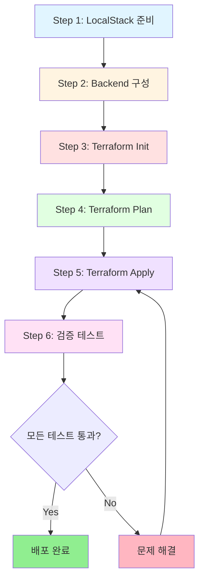

# Design: LocalStack Deployment & Validation

**작성일**: 2026-01-30
**작성자**: Claude Code
**Feature ID**: localstack-deployment
**PDCA Phase**: Design
**Based on**: [20260130-localstack-deployment.plan.md](../../01-plan/features/20260130-localstack-deployment.plan.md)

---

## 1. 배포 아키텍처 (Deployment Architecture)

### 1.1 전체 워크플로우



### 1.2 LocalStack 환경 구성

```
┌─────────────────────────────────────────────┐
│           LocalStack Container              │
│                                             │
│  ┌─────────────────────────────────────┐   │
│  │     AWS Services Emulator           │   │
│  │                                     │   │
│  │  • EC2        • VPC      • ELB     │   │
│  │  • RDS        • S3       • DynamoDB│   │
│  │  • IAM        • STS                │   │
│  └─────────────────────────────────────┘   │
│                                             │
│         Port: 4566 (Edge Service)           │
└─────────────────────────────────────────────┘
                    ▲
                    │ HTTP
                    │
┌─────────────────────────────────────────────┐
│          Terraform Workspace                │
│                                             │
│  environments/local/                        │
│  ├── main.tf (Module calls)                │
│  ├── backend.tf (S3 Backend)               │
│  ├── terraform.tfvars                      │
│  └── providers.tf (LocalStack endpoints)   │
└─────────────────────────────────────────────┘
```

### 1.3 Terraform State 관리

```
┌──────────────────────────────────┐
│  Terraform State Backend         │
│                                  │
│  ┌────────────────────────────┐  │
│  │   S3 Bucket                │  │
│  │   tfstate-local            │  │
│  │                            │  │
│  │   terraform.tfstate        │  │
│  │   (JSON format)            │  │
│  └────────────────────────────┘  │
│                                  │
│  ┌────────────────────────────┐  │
│  │   DynamoDB Table           │  │
│  │   terraform-locks          │  │
│  │                            │  │
│  │   LockID (Hash Key)        │  │
│  │   (Concurrent protection)  │  │
│  └────────────────────────────┘  │
└──────────────────────────────────┘
```

---

## 2. Phase별 상세 설계

### Phase 1: LocalStack 환경 준비

#### 2.1.1 목표
LocalStack 컨테이너가 실행 중이며 필요한 AWS 서비스가 Ready 상태임을 확인

#### 2.1.2 사전 요구사항
- Docker Desktop 설치 및 실행 중
- LocalStack 이미지 다운로드 완료
- awslocal CLI 설치 (선택사항)

#### 2.1.3 실행 절차

**Step 1.1: Docker 상태 확인**
```bash
# Windows PowerShell
docker --version
docker ps
```

**예상 출력**:
```
Docker version 24.0.0, build xxxxx
CONTAINER ID   IMAGE                   STATUS
abc123def456   localstack/localstack   Up 2 hours
```

**Step 1.2: LocalStack 실행 확인**
```bash
# LocalStack 컨테이너 확인
docker ps | Select-String "localstack"
```

**만약 실행 중이 아니면**:
```bash
# LocalStack 시작
docker-compose up -d localstack

# 또는 docker run
docker run -d `
  --name localstack `
  -p 4566:4566 `
  -e SERVICES=ec2,vpc,elbv2,rds,s3,dynamodb,iam,sts `
  localstack/localstack:latest
```

**Step 1.3: Health Check**
```bash
# LocalStack 서비스 상태 확인
curl http://localhost:4566/_localstack/health | ConvertFrom-Json | Format-List
```

**예상 출력**:
```json
{
  "services": {
    "ec2": "running",
    "vpc": "running",
    "elbv2": "running",
    "rds": "running",
    "s3": "running",
    "dynamodb": "running",
    "iam": "running",
    "sts": "running"
  }
}
```

#### 2.1.4 검증 체크리스트
- [ ] Docker 실행 중
- [ ] LocalStack 컨테이너 Up 상태
- [ ] 포트 4566 리스닝
- [ ] 필요 서비스(ec2, vpc, elbv2, rds, s3, dynamodb, iam, sts) 모두 "running"

#### 2.1.5 문제 해결

| 증상 | 원인 | 해결 |
|------|------|------|
| Docker 명령어 실패 | Docker 미실행 | Docker Desktop 시작 |
| LocalStack 컨테이너 없음 | 컨테이너 미생성 | docker-compose up 실행 |
| 포트 4566 접속 불가 | 방화벽/포트 충돌 | 포트 확인, 방화벽 설정 |
| 서비스 "not running" | 초기화 중 | 1-2분 대기 후 재확인 |

---

### Phase 2: Backend 인프라 구성

#### 2.2.1 목표
Terraform State 저장용 S3 버킷과 Lock용 DynamoDB 테이블 생성

#### 2.2.2 AWS CLI 설정

**awslocal CLI 사용 (권장)**:
```bash
# 설치 (pip)
pip install awscli-local

# 버전 확인
awslocal --version
```

**또는 aws CLI 직접 사용**:
```bash
# AWS CLI with endpoint
aws --endpoint-url=http://localhost:4566 s3 ls
```

#### 2.2.3 S3 Bucket 생성

**명령어**:
```bash
# S3 버킷 생성
awslocal s3 mb s3://tfstate-local

# 생성 확인
awslocal s3 ls
```

**예상 출력**:
```
make_bucket: tfstate-local

2026-01-30 10:00:00 tfstate-local
```

**버킷 속성 설정 (선택사항)**:
```bash
# Versioning 활성화 (State 히스토리 관리)
awslocal s3api put-bucket-versioning `
  --bucket tfstate-local `
  --versioning-configuration Status=Enabled
```

#### 2.2.4 DynamoDB 테이블 생성

**명령어**:
```bash
# DynamoDB 테이블 생성 (State Lock용)
awslocal dynamodb create-table `
  --table-name terraform-locks `
  --attribute-definitions AttributeName=LockID,AttributeType=S `
  --key-schema AttributeName=LockID,KeyType=HASH `
  --billing-mode PAY_PER_REQUEST
```

**예상 출력**:
```json
{
  "TableDescription": {
    "TableName": "terraform-locks",
    "TableStatus": "ACTIVE",
    "KeySchema": [
      {
        "AttributeName": "LockID",
        "KeyType": "HASH"
      }
    ],
    "AttributeDefinitions": [
      {
        "AttributeName": "LockID",
        "AttributeType": "S"
      }
    ]
  }
}
```

**테이블 확인**:
```bash
# 테이블 목록 조회
awslocal dynamodb list-tables

# 테이블 상세 정보
awslocal dynamodb describe-table --table-name terraform-locks
```

#### 2.2.5 검증 체크리스트
- [ ] S3 버킷 `tfstate-local` 존재
- [ ] DynamoDB 테이블 `terraform-locks` ACTIVE 상태
- [ ] 테이블 키 스키마: LockID (HASH)

#### 2.2.6 롤백 절차 (필요시)

```bash
# S3 버킷 삭제
awslocal s3 rb s3://tfstate-local --force

# DynamoDB 테이블 삭제
awslocal dynamodb delete-table --table-name terraform-locks
```

---

### Phase 3: Terraform 초기화

#### 2.3.1 목표
Terraform 작업 디렉토리 초기화, Provider 다운로드, Backend 연결

#### 2.3.2 환경 변수 설정

**PowerShell 스크립트 실행**:
```powershell
# 작업 디렉토리로 이동
cd C:\work\tf-lab

# LocalStack 환경 변수 설정
. .\scripts\set-localstack-env.ps1
```

**설정되는 환경 변수**:
```powershell
$env:AWS_ACCESS_KEY_ID     = "test"
$env:AWS_SECRET_ACCESS_KEY = "test"
$env:AWS_SESSION_TOKEN     = "test"
$env:AWS_DEFAULT_REGION    = "ap-northeast-2"
$env:AWS_EC2_METADATA_DISABLED = "true"
```

**검증**:
```powershell
echo $env:AWS_ACCESS_KEY_ID
echo $env:AWS_EC2_METADATA_DISABLED
```

#### 2.3.3 Backend 설정 파일 확인

**파일**: `environments/local/backend.hcl`

```hcl
region  = "ap-northeast-2"
encrypt = false

bucket = "tfstate-local"
key    = "tf-lab/terraform.tfstate"

dynamodb_table = "terraform-locks"

endpoint          = "http://localhost:4566"
dynamodb_endpoint = "http://localhost:4566"
sts_endpoint      = "http://localhost:4566"

skip_credentials_validation = true
skip_metadata_api_check     = true
skip_requesting_account_id  = true

force_path_style = true
```

#### 2.3.4 Terraform Init 실행

**작업 디렉토리**:
```bash
cd environments/local
```

**명령어**:
```bash
terraform init -backend-config=backend.hcl
```

**예상 출력**:
```
Initializing the backend...

Successfully configured the backend "s3"! Terraform will automatically
use this backend unless the backend configuration changes.

Initializing modules...
- alb in ../../modules/alb
- compute in ../../modules/compute
- rds in ../../modules/rds
- security_groups in ../../modules/security-groups
- vpc in ../../modules/vpc

Initializing provider plugins...
- Finding hashicorp/aws versions matching "~> 5.100"...
- Installing hashicorp/aws v5.100.0...
- Installed hashicorp/aws v5.100.0 (signed by HashiCorp)

Terraform has been successfully initialized!
```

#### 2.3.5 생성되는 파일

```
environments/local/
├── .terraform/                    # Provider 플러그인 디렉토리
│   └── providers/
│       └── registry.terraform.io/
│           └── hashicorp/
│               └── aws/
│                   └── 5.100.0/
└── .terraform.lock.hcl            # Provider 버전 잠금 파일
```

#### 2.3.6 검증 체크리스트
- [ ] Backend 초기화 성공 메시지
- [ ] 5개 모듈 로드 확인
- [ ] AWS Provider 5.100.0 설치
- [ ] `.terraform/` 디렉토리 생성
- [ ] `.terraform.lock.hcl` 파일 생성

#### 2.3.7 문제 해결

| 에러 | 원인 | 해결 |
|------|------|------|
| "Failed to get existing workspaces" | S3 버킷 미생성 | Phase 2 재실행 |
| "No valid credential sources" | 환경 변수 미설정 | `set-localstack-env.ps1` 실행 |
| "Backend initialization required" | Backend 설정 변경 | `-reconfigure` 플래그 추가 |

---

### Phase 4: Terraform Plan

#### 2.4.1 목표
배포할 리소스 계획 확인 및 Plan 파일 생성

#### 2.4.2 Plan 실행

**명령어**:
```bash
terraform plan -var-file=terraform.tfvars -out=tfplan
```

**예상 출력** (요약):
```
Terraform will perform the following actions:

  # module.vpc.aws_vpc.main will be created
  # module.vpc.aws_subnet.public[0] will be created
  # module.vpc.aws_subnet.public[1] will be created
  # ... (총 43개 리소스)

Plan: 43 to add, 0 to change, 0 to destroy.

Changes to Outputs:
  + alb_dns_name      = (known after apply)
  + bastion_public_ip = (known after apply)
  + vpc_id            = (known after apply)
  ...
```

#### 2.4.3 리소스 분류

| 모듈 | 리소스 수 | 주요 리소스 |
|------|-----------|-------------|
| **vpc** | 17 | VPC, IGW, NAT, EIP, 6 Subnets, Route Tables |
| **security_groups** | 8 | 4 SGs, 4 SG Rules |
| **alb** | 3 | ALB, Target Group, Listener |
| **compute** | 4 | Launch Template, ASG, Policy, Bastion |
| **rds** | 3 | DB Subnet Group, Parameter Group, Instance |
| **기타** | 8 | Default Tags, Associations |
| **합계** | **43** | |

#### 2.4.4 Plan 파일 검토

**명령어**:
```bash
# Plan 파일 내용 확인
terraform show tfplan

# 특정 리소스만 확인
terraform show -json tfplan | ConvertFrom-Json | Select-Object -ExpandProperty planned_values
```

#### 2.4.5 검증 체크리스트
- [ ] Plan 성공 (에러 없음)
- [ ] 43개 리소스 계획 확인
- [ ] 모든 모듈 포함 (vpc, security_groups, alb, compute, rds)
- [ ] Output 값 정의 확인
- [ ] `tfplan` 파일 생성

---

### Phase 5: Infrastructure Deployment

#### 2.5.1 목표
Plan 파일을 사용하여 실제 인프라 배포

#### 2.5.2 Apply 실행

**Option 1: Plan 파일 사용 (권장)**:
```bash
terraform apply tfplan
```

**Option 2: 직접 Apply**:
```bash
terraform apply -var-file=terraform.tfvars -auto-approve
```

#### 2.5.3 배포 진행 모니터링

**예상 출력**:
```
module.vpc.aws_vpc.main: Creating...
module.vpc.aws_vpc.main: Creation complete after 2s

module.vpc.aws_internet_gateway.igw: Creating...
module.vpc.aws_internet_gateway.igw: Creation complete after 1s

module.vpc.aws_subnet.public[0]: Creating...
module.vpc.aws_subnet.public[1]: Creating...
... (계속)

Apply complete! Resources: 43 added, 0 changed, 0 destroyed.

Outputs:
alb_dns_name = "tf-lab-local-alb-xxxx.elb.localhost.localstack.cloud"
bastion_public_ip = "192.168.x.x"
vpc_id = "vpc-xxxxxxxx"
...
```

#### 2.5.4 배포 순서 (Terraform 의존성)

```
1. VPC 생성
   ↓
2. Internet Gateway, Subnets 생성
   ↓
3. NAT Gateway (EIP 포함), Route Tables
   ↓
4. Security Groups
   ↓
5. ALB, Target Group (VPC, SG 의존)
   ↓
6. Launch Template, ASG (SG, Target Group 의존)
   ↓
7. Bastion Instance
   ↓
8. RDS (Subnet Group, Parameter Group, Instance)
```

#### 2.5.5 예상 소요 시간

| 리소스 그룹 | 소요 시간 |
|-------------|----------|
| VPC, Subnets | 10-20초 |
| NAT, IGW, Routes | 10-15초 |
| Security Groups | 5-10초 |
| ALB, Target Group | 20-30초 |
| Launch Template, ASG | 30-60초 |
| Bastion Instance | 20-30초 |
| RDS | 60-120초 (LocalStack 제한) |
| **총 예상** | **3-5분** |

#### 2.5.6 검증 체크리스트
- [ ] Apply 완료 (에러 없음)
- [ ] "43 added" 메시지 확인
- [ ] Outputs 값 출력됨
- [ ] State 파일 S3에 저장 확인

**State 파일 확인**:
```bash
awslocal s3 ls s3://tfstate-local/tf-lab/
```

---

### Phase 6: 배포 검증

#### 2.6.1 검증 매트릭스

| 카테고리 | 검증 항목 | 도구 | 예상 결과 |
|----------|----------|------|----------|
| **State** | State 파일 저장 | awslocal s3 | terraform.tfstate 존재 |
| **Outputs** | Output 값 표시 | terraform output | 8개 출력 값 |
| **VPC** | VPC 생성 | awslocal ec2 | 1개 VPC |
| **Subnets** | Subnet 생성 | awslocal ec2 | 6개 Subnets |
| **SG** | Security Groups | awslocal ec2 | 4개 SGs |
| **ALB** | Load Balancer | awslocal elbv2 | 1개 ALB |
| **EC2** | Instances | awslocal ec2 | 2-3개 (ASG + Bastion) |
| **ASG** | Auto Scaling Group | awslocal autoscaling | 1개 ASG, 2개 인스턴스 |
| **RDS** | DB Instance | awslocal rds | 1개 RDS |
| **웹** | HTTP 접속 | curl | "OK" 응답 |

#### 2.6.2 Terraform 검증

**State 리스트**:
```bash
terraform state list
```

**예상 출력** (43개 리소스):
```
module.alb.aws_lb.main
module.alb.aws_lb_listener.http
module.alb.aws_lb_target_group.app
module.compute.aws_autoscaling_group.app
module.compute.aws_autoscaling_policy.cpu_tracking
module.compute.aws_instance.bastion
module.compute.aws_launch_template.app
module.rds.aws_db_instance.main
module.rds.aws_db_parameter_group.mysql
module.rds.aws_db_subnet_group.main
module.security_groups.aws_security_group.alb
module.security_groups.aws_security_group.app
module.security_groups.aws_security_group.bastion
module.security_groups.aws_security_group.db
module.security_groups.aws_security_group_rule.alb_egress_all
module.security_groups.aws_security_group_rule.alb_ingress_http
... (총 43개)
```

**Outputs 확인**:
```bash
terraform output
```

**예상 출력**:
```
alb_dns_name      = "tf-lab-local-alb-xxxxx.elb.localhost.localstack.cloud"
alb_sg_id         = "sg-xxxxxxxx"
app_sg_id         = "sg-yyyyyyyy"
asg_name          = "tf-lab-local-asg"
bastion_public_ip = "192.168.x.x"
nat_eip           = "192.168.x.y"
rds_endpoint      = <sensitive>
vpc_id            = "vpc-xxxxxxxx"
```

#### 2.6.3 AWS CLI 검증

**VPC 확인**:
```bash
awslocal ec2 describe-vpcs `
  --filters "Name=tag:Name,Values=tf-lab-local-vpc" `
  --query 'Vpcs[0].[VpcId,CidrBlock,State]' `
  --output table
```

**Subnets 확인**:
```bash
awslocal ec2 describe-subnets `
  --filters "Name=vpc-id,Values=$(terraform output -raw vpc_id)" `
  --query 'Subnets[*].[SubnetId,CidrBlock,AvailabilityZone,Tags[?Key==`Name`].Value | [0]]' `
  --output table
```

**EC2 Instances 확인**:
```bash
awslocal ec2 describe-instances `
  --query 'Reservations[*].Instances[*].[InstanceId,State.Name,PrivateIpAddress,Tags[?Key==`Name`].Value | [0]]' `
  --output table
```

**ALB 확인**:
```bash
awslocal elbv2 describe-load-balancers `
  --query 'LoadBalancers[0].[LoadBalancerName,DNSName,State.Code]' `
  --output table
```

**Target Health 확인**:
```bash
# Target Group ARN 조회
TG_ARN=$(terraform output -raw alb_target_group_arn 2>$null)

# Target Health 확인
awslocal elbv2 describe-target-health `
  --target-group-arn $TG_ARN `
  --query 'TargetHealthDescriptions[*].[Target.Id,TargetHealth.State]' `
  --output table
```

#### 2.6.4 웹 애플리케이션 테스트

**Health Check**:
```bash
# ALB DNS 조회
$ALB_DNS = terraform output -raw alb_dns_name

# Health 엔드포인트 테스트
curl http://$ALB_DNS/health
```

**예상 응답**:
```
OK
```

**메인 페이지**:
```bash
curl http://$ALB_DNS/
```

**예상 응답** (HTML):
```html
<!DOCTYPE html>
<html lang="ko">
<head>
  <meta charset="UTF-8">
  <title>TF Lab - Modularized</title>
  ...
</head>
<body>
  <div class="container">
    <h1>🚀 Hello from Modular Terraform!</h1>
    <span class="badge">Module-based Architecture</span>
    ...
  </div>
</body>
</html>
```

**LocalStack 제약으로 ALB 접속 실패 시 대안**:
```bash
# EC2 인스턴스 직접 접속
$INSTANCE_ID = (awslocal ec2 describe-instances `
  --filters "Name=tag:Name,Values=tf-lab-local-asg-instance" `
  --query 'Reservations[0].Instances[0].InstanceId' `
  --output text)

$INSTANCE_IP = (awslocal ec2 describe-instances `
  --instance-ids $INSTANCE_ID `
  --query 'Reservations[0].Instances[0].PrivateIpAddress' `
  --output text)

curl http://$INSTANCE_IP/
```

#### 2.6.5 RDS 검증

**RDS 인스턴스 확인**:
```bash
awslocal rds describe-db-instances `
  --db-instance-identifier tf-lab-local-db `
  --query 'DBInstances[0].[DBInstanceIdentifier,DBInstanceStatus,Engine,EngineVersion,Endpoint.Address]' `
  --output table
```

**연결 테스트** (LocalStack Community 제한):
```bash
# RDS 엔드포인트 조회
$RDS_ENDPOINT = terraform output rds_endpoint

# MySQL 연결 시도 (제한적)
# mysql -h $RDS_ENDPOINT -u admin -p
# Password: changeme123!
```

**참고**: LocalStack Community 버전은 RDS 실제 연결을 지원하지 않습니다. Pro 버전 필요.

#### 2.6.6 검증 체크리스트

**Terraform**:
- [ ] `terraform state list` 43개 리소스
- [ ] `terraform output` 8개 출력
- [ ] S3에 state 파일 저장

**Infrastructure**:
- [ ] VPC 생성 (10.10.0.0/16)
- [ ] Subnets 6개 (Public 2, Private App 2, Private DB 2)
- [ ] Security Groups 4개
- [ ] ALB 생성
- [ ] EC2 Instances 2-3개
- [ ] ASG Desired 2, Min 2, Max 4
- [ ] Bastion Public IP 할당
- [ ] RDS Instance 생성

**Application**:
- [ ] `/health` 엔드포인트 "OK" 응답
- [ ] `/` 메인 페이지 HTML 반환
- [ ] Instance ID 표시
- [ ] AZ 정보 표시

---

## 3. 자동화 스크립트 설계

### 3.1 배포 스크립트 (`scripts/deploy-localstack.ps1`)

#### 3.1.1 기능
- LocalStack 상태 확인
- Backend 인프라 구성 (S3, DynamoDB)
- Terraform 초기화, Plan, Apply 실행
- 배포 결과 요약 출력

#### 3.1.2 스크립트 구조

```powershell
# scripts/deploy-localstack.ps1

[CmdletBinding()]
param(
    [switch]$SkipBackendSetup,
    [switch]$AutoApprove,
    [switch]$DestroyAfter
)

function Check-LocalStack {
    # LocalStack 실행 확인
}

function Setup-Backend {
    # S3 버킷, DynamoDB 테이블 생성
}

function Deploy-Infrastructure {
    # Terraform init, plan, apply
}

function Validate-Deployment {
    # 배포 검증
}

# Main
try {
    Check-LocalStack

    if (-not $SkipBackendSetup) {
        Setup-Backend
    }

    Deploy-Infrastructure -AutoApprove:$AutoApprove

    Validate-Deployment

    if ($DestroyAfter) {
        terraform destroy -auto-approve
    }
}
catch {
    Write-Error "Deployment failed: $_"
    exit 1
}
```

#### 3.1.3 사용 예제

```powershell
# 기본 배포
.\scripts\deploy-localstack.ps1

# 자동 승인
.\scripts\deploy-localstack.ps1 -AutoApprove

# Backend 설정 스킵 (이미 생성된 경우)
.\scripts\deploy-localstack.ps1 -SkipBackendSetup

# 배포 후 자동 삭제
.\scripts\deploy-localstack.ps1 -AutoApprove -DestroyAfter
```

---

### 3.2 검증 스크립트 (`scripts/validate-deployment.ps1`)

#### 3.2.1 기능
- Terraform State 확인
- AWS 리소스 조회
- 웹 애플리케이션 테스트
- 검증 보고서 생성

#### 3.2.2 검증 항목

```powershell
# scripts/validate-deployment.ps1

function Test-TerraformState {
    # terraform state list 확인
    # 43개 리소스 검증
}

function Test-VPCResources {
    # VPC, Subnets, IGW, NAT 검증
}

function Test-ComputeResources {
    # EC2, ASG, ALB 검증
}

function Test-WebApplication {
    # Health Check
    # 메인 페이지 접속
}

function Generate-Report {
    # 검증 결과를 Markdown 보고서로 생성
}

# Main
$results = @{
    State = Test-TerraformState
    VPC = Test-VPCResources
    Compute = Test-ComputeResources
    Web = Test-WebApplication
}

Generate-Report -Results $results
```

---

### 3.3 정리 스크립트 (`scripts/cleanup-localstack.ps1`)

#### 3.3.1 기능
```powershell
# Terraform 리소스 삭제
terraform destroy -auto-approve

# Backend 인프라 삭제
awslocal s3 rb s3://tfstate-local --force
awslocal dynamodb delete-table --table-name terraform-locks

# .terraform 디렉토리 정리
Remove-Item -Recurse -Force .terraform
Remove-Item terraform.tfstate*
Remove-Item tfplan
```

---

## 4. 에러 처리 및 롤백 전략

### 4.1 주요 에러 시나리오

#### 시나리오 1: LocalStack 미실행
**탐지**:
```powershell
if (-not (docker ps | Select-String "localstack")) {
    throw "LocalStack is not running"
}
```

**대응**:
1. Docker Desktop 실행 확인
2. LocalStack 컨테이너 시작
3. Health Check 대기

---

#### 시나리오 2: Backend 생성 실패
**탐지**:
```bash
awslocal s3 ls s3://tfstate-local 2>&1
```

**대응**:
1. LocalStack S3 서비스 상태 확인
2. 버킷 재생성 시도
3. 실패 시 로컬 Backend 사용 (임시)

---

#### 시나리오 3: Apply 중 에러
**탐지**:
```
Error: creating EC2 Instance: ...
```

**대응**:
1. 에러 로그 수집
2. 부분 성공 리소스 확인: `terraform state list`
3. 롤백 옵션:
   - **Option A**: `terraform destroy` 후 재시도
   - **Option B**: 문제 리소스만 `terraform taint` 후 재적용

---

#### 시나리오 4: RDS 생성 실패 (예상)
**탐지**:
```
Error: creating RDS DB Instance: operation error RDS: CreateDBInstance
```

**대응**:
1. LocalStack Community 제약 인지
2. RDS 모듈 주석 처리 옵션:
```hcl
# environments/local/main.tf
# module "rds" {
#   source = "../../modules/rds"
#   ...
# }
```
3. 또는 LocalStack Pro 사용 권장

---

### 4.2 롤백 절차

#### 완전 롤백
```bash
# 1. Terraform 리소스 삭제
terraform destroy -auto-approve

# 2. Backend 정리
awslocal s3 rm s3://tfstate-local/tf-lab/terraform.tfstate
awslocal s3 rb s3://tfstate-local
awslocal dynamodb delete-table --table-name terraform-locks

# 3. 로컬 파일 정리
rm -rf .terraform
rm terraform.tfstate*
rm tfplan
```

#### 부분 롤백
```bash
# 특정 리소스만 삭제
terraform destroy -target=module.rds.aws_db_instance.main

# 또는 State에서 제거 (실제 리소스는 유지)
terraform state rm module.rds.aws_db_instance.main
```

---

## 5. 문서 구조

### 5.1 배포 가이드
**파일**: `docs/guides/localstack-deployment-guide.md`

**내용**:
1. 사전 요구사항
2. 단계별 배포 절차
3. 스크립트 사용법
4. 검증 체크리스트
5. 스크린샷

---

### 5.2 트러블슈팅 가이드
**파일**: `docs/guides/troubleshooting.md`

**내용**:
1. 자주 발생하는 에러 목록
2. LocalStack 제약사항
3. 디버깅 팁
4. FAQ

---

### 5.3 검증 보고서
**파일**: `docs/03-validation/20260130-deployment-validation.md`

**템플릿**:
```markdown
# Deployment Validation Report

## 배포 정보
- 날짜: 2026-01-30
- 환경: LocalStack
- Terraform 버전: 1.x.x
- Provider: AWS 5.100.0

## 리소스 현황
- 계획: 43 resources
- 성공: XX resources
- 실패: YY resources

## 상세 검증 결과
[검증 매트릭스 결과]

## 웹 접속 테스트
[스크린샷]

## 문제 및 해결
[발생한 이슈 목록]

## 결론
배포 성공률: XX%
```

---

## 6. 타임라인

### 6.1 단계별 소요 시간

| Phase | 작업 | 예상 시간 |
|-------|------|----------|
| **1** | LocalStack 준비 | 10분 |
| **2** | Backend 구성 | 10분 |
| **3** | Terraform Init | 5분 |
| **4** | Terraform Plan | 5분 |
| **5** | Terraform Apply | 5-10분 |
| **6** | 검증 테스트 | 10-15분 |
| **문서화** | 보고서 작성 | 15-20분 |
| **총계** | | **60-75분** |

### 6.2 마일스톤

```
M1 [LocalStack Ready]      ─────► Phase 1-2 완료
M2 [Terraform Ready]       ─────► Phase 3 완료
M3 [Plan Validated]        ─────► Phase 4 완료
M4 [Infrastructure Live]   ─────► Phase 5 완료
M5 [Validation Complete]   ─────► Phase 6 완료
M6 [Documentation Done]    ─────► 문서 완료
```

---

## 7. 성공 기준

### 7.1 필수 기준 (Must-Have)
- [ ] 43개 리소스 중 40개 이상(93%) 배포 성공
- [ ] VPC, Subnets, Security Groups 100% 성공
- [ ] EC2 Instances (ASG) 생성 및 실행
- [ ] 웹 페이지 접속 가능 (ALB 또는 직접)
- [ ] Health Check 엔드포인트 응답

### 7.2 선택 기준 (Nice-to-Have)
- [ ] ALB 라우팅 정상 작동
- [ ] RDS 인스턴스 생성 성공
- [ ] RDS 연결 가능 (LocalStack Pro)
- [ ] Auto Scaling 이벤트 발생

### 7.3 학습 목표
- [ ] LocalStack 환경 설정 및 운영 이해
- [ ] Terraform Backend 구성 경험
- [ ] 배포 자동화 스크립트 작성
- [ ] 인프라 검증 방법론 습득
- [ ] LocalStack 제약사항 파악

---

## 8. 다음 단계

배포 성공 후:
1. **Do Phase**: 실제 배포 수행 및 문서화
2. **Check Phase**: 검증 결과 분석
3. **Act Phase**: 개선사항 도출 및 완료 보고서

---

**설계 완료일**: 2026-01-30
**다음 단계**: Do Phase - 실제 배포 수행
