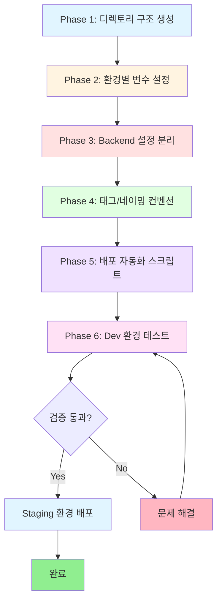

# Design: Multi-Environment Setup

**작성일**: 2026-01-30
**작성자**: Claude Code
**Feature ID**: multi-environment-setup
**PDCA Phase**: Design
**Based on**: [20260130-multi-environment-setup.plan.md](../../01-plan/features/20260130-multi-environment-setup.plan.md)

---

## 1. 멀티 환경 아키텍처 (Multi-Environment Architecture)

### 1.1 전체 워크플로우



### 1.2 환경별 아키텍처 구성

```
┌─────────────────────────────────────────────────────────────┐
│                   Multi-Environment Setup                   │
└─────────────────────────────────────────────────────────────┘
                              │
        ┌─────────────────────┼─────────────────────┐
        ▼                     ▼                     ▼
┌───────────────┐     ┌───────────────┐     ┌───────────────┐
│  Dev Environment      │  Staging Env      │  Prod Environment │
│                │     │                │     │                │
│  VPC: 10.0/16  │     │  VPC: 10.1/16  │     │  VPC: 10.2/16  │
│  AZ: 1개       │     │  AZ: 2개       │     │  AZ: 2개       │
│  ASG: 1-2      │     │  ASG: 2-4      │     │  ASG: 2-10     │
│  Instance: t2  │     │  Instance: t2  │     │  Instance: t3  │
│  RDS: Single   │     │  RDS: Multi-AZ │     │  RDS: Multi-AZ │
│                │     │                │     │                │
│  Backend:      │     │  Backend:      │     │  Backend:      │
│  tfstate-dev   │     │  tfstate-stag  │     │  tfstate-prod  │
└───────────────┘     └───────────────┘     └───────────────┘
```

### 1.3 디렉토리 기반 환경 격리

```
environments/
│
├── dev/                          # 개발 환경
│   ├── main.tf                   # 모듈 호출 (dev 설정)
│   ├── variables.tf              # 변수 정의
│   ├── terraform.tfvars          # dev 환경 변수 값
│   ├── backend.hcl               # dev backend (tfstate-dev)
│   ├── providers.tf              # LocalStack provider
│   ├── outputs.tf                # 출력 값
│   └── README.md                 # dev 환경 설명
│
├── staging/                      # 스테이징 환경
│   ├── main.tf                   # 모듈 호출 (staging 설정)
│   ├── variables.tf              # 변수 정의
│   ├── terraform.tfvars          # staging 환경 변수 값
│   ├── backend.hcl               # staging backend (tfstate-staging)
│   ├── providers.tf              # LocalStack provider
│   ├── outputs.tf                # 출력 값
│   └── README.md                 # staging 환경 설명
│
└── prod/                         # 프로덕션 환경
    ├── main.tf                   # 모듈 호출 (prod 설정)
    ├── variables.tf              # 변수 정의
    ├── terraform.tfvars          # prod 환경 변수 값
    ├── backend.hcl               # prod backend (tfstate-prod)
    ├── providers.tf              # AWS provider (실제 운영 시)
    ├── outputs.tf                # 출력 값
    └── README.md                 # prod 환경 설명
```

### 1.4 Backend State 격리 전략

```
┌──────────────────────────────────────────────────────┐
│               LocalStack S3 Backend                  │
│                                                      │
│  ┌────────────────┐  ┌────────────────┐  ┌────────────────┐
│  │ tfstate-dev    │  │ tfstate-staging│  │ tfstate-prod   │
│  │                │  │                │  │                │
│  │ tf-lab/dev/    │  │ tf-lab/staging/│  │ tf-lab/prod/   │
│  │ terraform.tfstate  │ terraform.tfstate  │ terraform.tfstate
│  └────────────────┘  └────────────────┘  └────────────────┘
│                                                      │
│  ┌────────────────┐  ┌────────────────┐  ┌────────────────┐
│  │ terraform-     │  │ terraform-     │  │ terraform-     │
│  │ locks-dev      │  │ locks-staging  │  │ locks-prod     │
│  │ (DynamoDB)     │  │ (DynamoDB)     │  │ (DynamoDB)     │
│  └────────────────┘  └────────────────┘  └────────────────┘
└──────────────────────────────────────────────────────┘

격리 원칙:
✅ 환경별 독립적인 S3 버킷
✅ 환경별 독립적인 DynamoDB Lock 테이블
✅ State 파일 경로에 환경명 포함
✅ 동시 작업 가능 (다른 환경)
```

---

## 2. Phase별 상세 설계

### Phase 1: 디렉토리 구조 생성

#### 2.1.1 목표
Dev, Staging, Prod 3개 환경 디렉토리 및 기본 파일 구조 생성

#### 2.1.2 사전 요구사항
- `environments/local/` 디렉토리가 존재하고 동작하는 상태
- Git 저장소 초기화 완료
- PowerShell 또는 Bash 터미널 접근 가능

#### 2.1.3 실행 절차

**Step 1.1: 디렉토리 생성**
```powershell
# environments 디렉토리로 이동
cd environments

# 3개 환경 디렉토리 생성
New-Item -ItemType Directory -Path "dev", "staging", "prod" -Force
```

**Step 1.2: local 디렉토리를 dev로 복사**
```powershell
# local의 기본 구조를 dev로 복사
Copy-Item -Path "local\*" -Destination "dev\" -Recurse -Force

# staging과 prod도 동일하게 복사
Copy-Item -Path "local\*" -Destination "staging\" -Recurse -Force
Copy-Item -Path "local\*" -Destination "prod\" -Recurse -Force
```

**Step 1.3: 환경별 README.md 생성**

각 환경 디렉토리에 `README.md` 파일 생성:

**dev/README.md**:
```markdown
# Dev Environment

## 목적
개발자 테스트 및 기능 검증 환경

## 특징
- Single AZ 구성 (비용 최소화)
- 작은 인스턴스 타입 (t2.micro)
- RDS Single-AZ
- LocalStack Backend

## 배포 방법
```powershell
.\scripts\deploy-env.ps1 -Environment dev -Action init
.\scripts\deploy-env.ps1 -Environment dev -Action plan
.\scripts\deploy-env.ps1 -Environment dev -Action apply
```

## 리소스 구성
- VPC CIDR: 10.0.0.0/16
- Availability Zones: ap-northeast-2a (1개)
- Bastion: t2.micro
- App Instance: t2.micro
- ASG: Min 1, Max 2, Desired 1
- RDS: db.t3.micro, 20GB, Single-AZ
```

**staging/README.md**:
```markdown
# Staging Environment

## 목적
프로덕션 배포 전 최종 검증 환경

## 특징
- Multi-AZ 구성
- 중간 크기 인스턴스 타입 (t2.small)
- RDS Multi-AZ
- LocalStack Backend

## 배포 방법
```powershell
.\scripts\deploy-env.ps1 -Environment staging -Action init
.\scripts\deploy-env.ps1 -Environment staging -Action plan
.\scripts\deploy-env.ps1 -Environment staging -Action apply
```

## 리소스 구성
- VPC CIDR: 10.1.0.0/16
- Availability Zones: ap-northeast-2a, ap-northeast-2c (2개)
- Bastion: t2.small
- App Instance: t2.small
- ASG: Min 2, Max 4, Desired 2
- RDS: db.t3.small, 50GB, Multi-AZ
```

**prod/README.md**:
```markdown
# Production Environment

## 목적
실제 서비스 운영 환경

## 특징
- Multi-AZ 고가용성 구성
- 큰 인스턴스 타입 (t3.medium)
- RDS Multi-AZ with 백업
- LocalStack (학습용) / AWS S3 (실제 운영)

## 배포 방법
```powershell
# ⚠️ WARNING: 프로덕션 배포 - 신중하게 진행
.\scripts\deploy-env.ps1 -Environment prod -Action init
.\scripts\deploy-env.ps1 -Environment prod -Action plan
.\scripts\deploy-env.ps1 -Environment prod -Action apply
```

## 리소스 구성
- VPC CIDR: 10.2.0.0/16
- Availability Zones: ap-northeast-2a, ap-northeast-2c (2개)
- Bastion: t3.small
- App Instance: t3.medium
- ASG: Min 2, Max 10, Desired 4
- RDS: db.t3.medium, 100GB, Multi-AZ
```

#### 2.1.4 예상 결과

```
environments/
├── dev/
│   ├── main.tf
│   ├── variables.tf
│   ├── terraform.tfvars
│   ├── backend.tf
│   ├── backend.hcl
│   ├── providers.tf
│   ├── outputs.tf
│   ├── user-data.sh
│   └── README.md          ← 새로 생성
├── staging/
│   ├── main.tf
│   ├── variables.tf
│   ├── terraform.tfvars
│   ├── backend.tf
│   ├── backend.hcl
│   ├── providers.tf
│   ├── outputs.tf
│   ├── user-data.sh
│   └── README.md          ← 새로 생성
└── prod/
    ├── main.tf
    ├── variables.tf
    ├── terraform.tfvars
    ├── backend.tf
    ├── backend.hcl
    ├── providers.tf
    ├── outputs.tf
    ├── user-data.sh
    └── README.md          ← 새로 생성
```

---

### Phase 2: 환경별 변수 설정

#### 2.2.1 목표
각 환경에 맞는 변수 값을 `terraform.tfvars` 파일에 정의하여 차별화

#### 2.2.2 변수 차별화 전략

| 변수 | Dev | Staging | Prod | 이유 |
|------|-----|---------|------|------|
| `env_name` | "dev" | "staging" | "prod" | 환경 식별 |
| `vpc_cidr` | 10.0.0.0/16 | 10.1.0.0/16 | 10.2.0.0/16 | IP 대역 분리 |
| `availability_zones` | ["2a"] | ["2a", "2c"] | ["2a", "2c"] | 가용성 요구사항 |
| `bastion_instance_type` | t2.micro | t2.small | t3.small | 성능/비용 균형 |
| `app_instance_type` | t2.micro | t2.small | t3.medium | 워크로드 크기 |
| `asg_min_size` | 1 | 2 | 2 | 최소 가용성 |
| `asg_max_size` | 2 | 4 | 10 | 스케일 아웃 여력 |
| `asg_desired_capacity` | 1 | 2 | 4 | 일반 트래픽 처리 |
| `db_instance_class` | db.t3.micro | db.t3.small | db.t3.medium | 데이터베이스 성능 |
| `db_allocated_storage` | 20 | 50 | 100 | 스토리지 크기 |
| `db_multi_az` | false | true | true | 고가용성 요구사항 |

#### 2.2.3 Dev 환경 변수 파일

**dev/terraform.tfvars**:
```hcl
################################################################################
# Dev Environment Configuration
################################################################################

# 프로젝트 기본 정보
project_name = "tf-lab"
env_name     = "dev"
aws_region   = "ap-northeast-2"

################################################################################
# VPC Configuration
################################################################################
vpc_cidr             = "10.0.0.0/16"
availability_zones   = ["ap-northeast-2a"]  # Single AZ for cost saving
public_subnet_cidrs  = ["10.0.1.0/24"]
private_app_cidrs    = ["10.0.11.0/24"]
private_db_cidrs     = ["10.0.21.0/24"]

################################################################################
# Compute Configuration
################################################################################
bastion_instance_type = "t2.micro"
bastion_ami           = "ami-0c9c942bd7bf113a2"  # Amazon Linux 2023 (ap-northeast-2)

app_instance_type     = "t2.micro"
app_ami               = "ami-0c9c942bd7bf113a2"

# Auto Scaling Group
asg_min_size          = 1
asg_max_size          = 2
asg_desired_capacity  = 1
asg_health_check_grace_period = 300
asg_health_check_type = "ELB"

################################################################################
# Load Balancer Configuration
################################################################################
alb_internal          = false
alb_idle_timeout      = 60
health_check_path     = "/health"
health_check_interval = 30
health_check_timeout  = 5
healthy_threshold     = 2
unhealthy_threshold   = 2

################################################################################
# RDS Configuration
################################################################################
db_identifier         = "tf-lab-dev-db"
db_name               = "devdb"
db_username           = "devadmin"
db_password           = "DevPassword123!"  # TODO: Use Secrets Manager in production
db_instance_class     = "db.t3.micro"
db_allocated_storage  = 20
db_max_allocated_storage = 50
db_engine             = "mysql"
db_engine_version     = "8.0.35"
db_multi_az           = false  # Single AZ for dev
db_backup_retention_period = 1
db_backup_window      = "03:00-04:00"
db_maintenance_window = "sun:04:00-sun:05:00"
db_skip_final_snapshot = true
db_deletion_protection = false

################################################################################
# Tags
################################################################################
# 공통 태그는 main.tf의 locals에서 자동 생성됨
```

#### 2.2.4 Staging 환경 변수 파일

**staging/terraform.tfvars**:
```hcl
################################################################################
# Staging Environment Configuration
################################################################################

# 프로젝트 기본 정보
project_name = "tf-lab"
env_name     = "staging"
aws_region   = "ap-northeast-2"

################################################################################
# VPC Configuration
################################################################################
vpc_cidr             = "10.1.0.0/16"
availability_zones   = ["ap-northeast-2a", "ap-northeast-2c"]  # Multi-AZ
public_subnet_cidrs  = ["10.1.1.0/24", "10.1.2.0/24"]
private_app_cidrs    = ["10.1.11.0/24", "10.1.12.0/24"]
private_db_cidrs     = ["10.1.21.0/24", "10.1.22.0/24"]

################################################################################
# Compute Configuration
################################################################################
bastion_instance_type = "t2.small"
bastion_ami           = "ami-0c9c942bd7bf113a2"

app_instance_type     = "t2.small"
app_ami               = "ami-0c9c942bd7bf113a2"

# Auto Scaling Group
asg_min_size          = 2
asg_max_size          = 4
asg_desired_capacity  = 2
asg_health_check_grace_period = 300
asg_health_check_type = "ELB"

################################################################################
# Load Balancer Configuration
################################################################################
alb_internal          = false
alb_idle_timeout      = 60
health_check_path     = "/health"
health_check_interval = 30
health_check_timeout  = 5
healthy_threshold     = 2
unhealthy_threshold   = 2

################################################################################
# RDS Configuration
################################################################################
db_identifier         = "tf-lab-staging-db"
db_name               = "stagingdb"
db_username           = "stagingadmin"
db_password           = "StagingPassword123!"  # TODO: Use Secrets Manager
db_instance_class     = "db.t3.small"
db_allocated_storage  = 50
db_max_allocated_storage = 100
db_engine             = "mysql"
db_engine_version     = "8.0.35"
db_multi_az           = true  # Multi-AZ for staging
db_backup_retention_period = 7
db_backup_window      = "03:00-04:00"
db_maintenance_window = "sun:04:00-sun:05:00"
db_skip_final_snapshot = true
db_deletion_protection = false

################################################################################
# Tags
################################################################################
# 공통 태그는 main.tf의 locals에서 자동 생성됨
```

#### 2.2.5 Prod 환경 변수 파일

**prod/terraform.tfvars**:
```hcl
################################################################################
# Production Environment Configuration
################################################################################

# 프로젝트 기본 정보
project_name = "tf-lab"
env_name     = "prod"
aws_region   = "ap-northeast-2"

################################################################################
# VPC Configuration
################################################################################
vpc_cidr             = "10.2.0.0/16"
availability_zones   = ["ap-northeast-2a", "ap-northeast-2c"]  # Multi-AZ
public_subnet_cidrs  = ["10.2.1.0/24", "10.2.2.0/24"]
private_app_cidrs    = ["10.2.11.0/24", "10.2.12.0/24"]
private_db_cidrs     = ["10.2.21.0/24", "10.2.22.0/24"]

################################################################################
# Compute Configuration
################################################################################
bastion_instance_type = "t3.small"
bastion_ami           = "ami-0c9c942bd7bf113a2"

app_instance_type     = "t3.medium"
app_ami               = "ami-0c9c942bd7bf113a2"

# Auto Scaling Group
asg_min_size          = 2
asg_max_size          = 10
asg_desired_capacity  = 4
asg_health_check_grace_period = 300
asg_health_check_type = "ELB"

################################################################################
# Load Balancer Configuration
################################################################################
alb_internal          = false
alb_idle_timeout      = 120  # Longer timeout for production
health_check_path     = "/health"
health_check_interval = 30
health_check_timeout  = 5
healthy_threshold     = 2
unhealthy_threshold   = 2

################################################################################
# RDS Configuration
################################################################################
db_identifier         = "tf-lab-prod-db"
db_name               = "proddb"
db_username           = "prodadmin"
db_password           = "ProductionPassword123!"  # TODO: Use Secrets Manager (REQUIRED)
db_instance_class     = "db.t3.medium"
db_allocated_storage  = 100
db_max_allocated_storage = 200
db_engine             = "mysql"
db_engine_version     = "8.0.35"
db_multi_az           = true  # Multi-AZ for production
db_backup_retention_period = 14  # 14 days backup
db_backup_window      = "03:00-04:00"
db_maintenance_window = "sun:04:00-sun:05:00"
db_skip_final_snapshot = false  # Keep final snapshot
db_deletion_protection = true   # Prevent accidental deletion

################################################################################
# Tags
################################################################################
# 공통 태그는 main.tf의 locals에서 자동 생성됨
```

#### 2.2.6 예상 결과

각 환경의 `terraform.tfvars` 파일이 환경별 특성에 맞게 설정됨:
- ✅ Dev: 최소 비용, Single AZ
- ✅ Staging: 프로덕션 유사, Multi-AZ
- ✅ Prod: 고가용성, 큰 리소스, Multi-AZ

---

### Phase 3: Backend 설정 분리

#### 2.3.1 목표
환경별 독립적인 Backend 설정으로 State 격리 달성

#### 2.3.2 Backend 격리 전략

```
State 격리 3원칙:
1. 환경별 독립적인 S3 버킷 (tfstate-{env})
2. 환경별 독립적인 DynamoDB 테이블 (terraform-locks-{env})
3. State 파일 경로에 환경명 포함 (tf-lab/{env}/terraform.tfstate)
```

#### 2.3.3 Dev Backend 설정

**dev/backend.hcl**:
```hcl
################################################################################
# Dev Environment Backend Configuration
################################################################################

# S3 Bucket (LocalStack)
bucket         = "tfstate-dev"
key            = "tf-lab/dev/terraform.tfstate"
region         = "ap-northeast-2"

# DynamoDB Lock Table
dynamodb_table = "terraform-locks-dev"

# LocalStack 설정
endpoint                    = "http://localhost:4566"
skip_credentials_validation = true
skip_metadata_api_check     = true
skip_requesting_account_id  = true
force_path_style            = true

# 암호화 설정 (실제 AWS에서 활성화)
# encrypt        = true
# kms_key_id     = "alias/terraform-state-key"
```

**dev/backend.tf**:
```hcl
terraform {
  backend "s3" {
    # backend.hcl에서 설정 로드
    # terraform init -backend-config=backend.hcl
  }
}
```

#### 2.3.4 Staging Backend 설정

**staging/backend.hcl**:
```hcl
################################################################################
# Staging Environment Backend Configuration
################################################################################

# S3 Bucket (LocalStack)
bucket         = "tfstate-staging"
key            = "tf-lab/staging/terraform.tfstate"
region         = "ap-northeast-2"

# DynamoDB Lock Table
dynamodb_table = "terraform-locks-staging"

# LocalStack 설정
endpoint                    = "http://localhost:4566"
skip_credentials_validation = true
skip_metadata_api_check     = true
skip_requesting_account_id  = true
force_path_style            = true

# 암호화 설정 (실제 AWS에서 활성화)
# encrypt        = true
# kms_key_id     = "alias/terraform-state-key"
```

**staging/backend.tf**:
```hcl
terraform {
  backend "s3" {
    # backend.hcl에서 설정 로드
    # terraform init -backend-config=backend.hcl
  }
}
```

#### 2.3.5 Prod Backend 설정

**prod/backend.hcl**:
```hcl
################################################################################
# Production Environment Backend Configuration
################################################################################

# S3 Bucket (LocalStack for learning, AWS S3 for production)
bucket         = "tfstate-prod"
key            = "tf-lab/prod/terraform.tfstate"
region         = "ap-northeast-2"

# DynamoDB Lock Table
dynamodb_table = "terraform-locks-prod"

# LocalStack 설정 (학습 시)
# 실제 AWS 배포 시 아래 4줄 제거
endpoint                    = "http://localhost:4566"
skip_credentials_validation = true
skip_metadata_api_check     = true
skip_requesting_account_id  = true
force_path_style            = true

# 암호화 설정 (실제 AWS에서 활성화 - REQUIRED for production)
# encrypt        = true
# kms_key_id     = "alias/terraform-state-key"
```

**prod/backend.tf**:
```hcl
terraform {
  backend "s3" {
    # backend.hcl에서 설정 로드
    # terraform init -backend-config=backend.hcl
  }
}
```

#### 2.3.6 Backend 초기화 스크립트

**scripts/init-backends.ps1**:
```powershell
<#
.SYNOPSIS
  모든 환경의 Backend 인프라를 LocalStack에 생성

.DESCRIPTION
  Dev, Staging, Prod 환경의 S3 버킷과 DynamoDB 테이블을 LocalStack에 생성한다.
  각 환경은 완전히 독립적인 Backend 리소스를 가진다.

.USAGE
  .\scripts\init-backends.ps1

.NOTES
  - LocalStack 컨테이너가 실행 중이어야 함
  - AWS CLI 설치 필요
  - 환경변수 AWS_* 설정 필요 (set-localstack-env.ps1)
#>

$ErrorActionPreference = "Stop"

# AWS 환경변수 설정
Write-Host "Setting AWS environment variables..." -ForegroundColor Cyan
. .\scripts\set-localstack-env.ps1

Write-Host "`n================================================" -ForegroundColor Cyan
Write-Host "Creating Backend Infrastructure for All Environments" -ForegroundColor Yellow
Write-Host "================================================`n" -ForegroundColor Cyan

$environments = @("dev", "staging", "prod")
$endpoint = "http://localhost:4566"

foreach ($env in $environments) {
    Write-Host "──────────────────────────────────────────────" -ForegroundColor Gray
    Write-Host "Environment: $env" -ForegroundColor Yellow
    Write-Host "──────────────────────────────────────────────" -ForegroundColor Gray

    # S3 버킷 이름 및 DynamoDB 테이블 이름
    $bucket = "tfstate-$env"
    $table = "terraform-locks-$env"

    # S3 버킷 생성
    Write-Host "[1/3] Creating S3 bucket: $bucket" -ForegroundColor Green
    try {
        aws s3 mb "s3://$bucket" --endpoint-url=$endpoint 2>$null
        Write-Host "      ✓ Bucket created successfully" -ForegroundColor Green
    } catch {
        Write-Host "      ⚠ Bucket may already exist (ignoring error)" -ForegroundColor Yellow
    }

    # 버킷 버저닝 활성화
    Write-Host "[2/3] Enabling versioning for: $bucket" -ForegroundColor Green
    aws s3api put-bucket-versioning `
        --bucket $bucket `
        --versioning-configuration Status=Enabled `
        --endpoint-url=$endpoint
    Write-Host "      ✓ Versioning enabled" -ForegroundColor Green

    # DynamoDB 테이블 생성
    Write-Host "[3/3] Creating DynamoDB table: $table" -ForegroundColor Green
    try {
        aws dynamodb create-table `
            --table-name $table `
            --attribute-definitions AttributeName=LockID,AttributeType=S `
            --key-schema AttributeName=LockID,KeyType=HASH `
            --billing-mode PAY_PER_REQUEST `
            --endpoint-url=$endpoint 2>$null | Out-Null
        Write-Host "      ✓ Table created successfully" -ForegroundColor Green
    } catch {
        Write-Host "      ⚠ Table may already exist (ignoring error)" -ForegroundColor Yellow
    }

    Write-Host ""
}

Write-Host "================================================" -ForegroundColor Cyan
Write-Host "✅ All Backend Resources Created Successfully!" -ForegroundColor Green
Write-Host "================================================`n" -ForegroundColor Cyan

# 생성된 리소스 확인
Write-Host "Verifying created resources..." -ForegroundColor Cyan
Write-Host "`nS3 Buckets:" -ForegroundColor Yellow
aws s3 ls --endpoint-url=$endpoint

Write-Host "`nDynamoDB Tables:" -ForegroundColor Yellow
aws dynamodb list-tables --endpoint-url=$endpoint --query 'TableNames' --output table
```

#### 2.3.7 예상 결과

Backend 초기화 후:
```
S3 Buckets:
- tfstate-dev
- tfstate-staging
- tfstate-prod

DynamoDB Tables:
- terraform-locks-dev
- terraform-locks-staging
- terraform-locks-prod
```

각 환경의 State는 완전히 격리됨.

---

### Phase 4: 태그 및 네이밍 컨벤션

#### 2.4.1 목표
환경별 리소스를 명확히 구분할 수 있는 네이밍 규칙 및 태그 전략 적용

#### 2.4.2 네이밍 컨벤션

**규칙**: `{project_name}-{env_name}-{resource_type}`

**예시**:
```
VPC:           tf-lab-dev-vpc, tf-lab-staging-vpc, tf-lab-prod-vpc
Bastion:       tf-lab-dev-bastion, tf-lab-staging-bastion, tf-lab-prod-bastion
ASG:           tf-lab-dev-asg, tf-lab-staging-asg, tf-lab-prod-asg
ALB:           tf-lab-dev-alb, tf-lab-staging-alb, tf-lab-prod-alb
RDS:           tf-lab-dev-db, tf-lab-staging-db, tf-lab-prod-db
Security Group: tf-lab-dev-bastion-sg, tf-lab-staging-bastion-sg
Subnet:        tf-lab-dev-public-2a, tf-lab-staging-private-app-2c
```

#### 2.4.3 태그 전략

**공통 태그** (모든 리소스에 자동 적용):
```hcl
{
  Project     = "tf-lab"
  Environment = "{env_name}"  # dev, staging, prod
  ManagedBy   = "Terraform"
  CreatedAt   = "2026-01-30"
  Owner       = "DevOps-Team"
  Repository  = "https://github.com/your-org/tf-lab"
}
```

**리소스별 추가 태그**:
```hcl
# VPC
{
  Name        = "tf-lab-{env}-vpc"
  Type        = "vpc"
  CostCenter  = "{env}-infrastructure"
}

# Compute
{
  Name        = "tf-lab-{env}-bastion"
  Type        = "bastion"
  Role        = "bastion-host"
}

# RDS
{
  Name        = "tf-lab-{env}-db"
  Type        = "database"
  Engine      = "mysql"
  BackupPlan  = "{env}-backup"
}
```

#### 2.4.4 main.tf 수정 (모든 환경 공통)

각 환경의 `main.tf` 파일에 공통 태그 로직 추가:

**dev/main.tf** (staging, prod도 동일 패턴):
```hcl
terraform {
  required_version = ">= 1.0"

  required_providers {
    aws = {
      source  = "hashicorp/aws"
      version = "~> 5.100.0"
    }
  }
}

################################################################################
# Local Variables
################################################################################
locals {
  # 공통 태그 정의
  common_tags = {
    Project     = var.project_name
    Environment = var.env_name
    ManagedBy   = "Terraform"
    CreatedAt   = "2026-01-30"
    Owner       = "DevOps-Team"
    Repository  = "https://github.com/your-org/tf-lab"
  }

  # 환경별 네이밍 접두사
  name_prefix = "${var.project_name}-${var.env_name}"
}

################################################################################
# VPC Module
################################################################################
module "vpc" {
  source = "../../modules/vpc"

  project_name       = var.project_name
  env_name           = var.env_name
  vpc_cidr           = var.vpc_cidr
  availability_zones = var.availability_zones
  public_subnet_cidrs  = var.public_subnet_cidrs
  private_app_cidrs    = var.private_app_cidrs
  private_db_cidrs     = var.private_db_cidrs

  tags = merge(
    local.common_tags,
    {
      Name = "${local.name_prefix}-vpc"
      Type = "vpc"
    }
  )
}

################################################################################
# Security Groups Module
################################################################################
module "security_groups" {
  source = "../../modules/security-groups"

  project_name = var.project_name
  env_name     = var.env_name
  vpc_id       = module.vpc.vpc_id
  vpc_cidr     = var.vpc_cidr

  tags = merge(
    local.common_tags,
    {
      Type = "security-group"
    }
  )
}

################################################################################
# Compute Module
################################################################################
module "compute" {
  source = "../../modules/compute"

  project_name              = var.project_name
  env_name                  = var.env_name
  vpc_id                    = module.vpc.vpc_id
  public_subnet_ids         = module.vpc.public_subnet_ids
  private_app_subnet_ids    = module.vpc.private_app_subnet_ids
  bastion_security_group_id = module.security_groups.bastion_sg_id
  app_security_group_id     = module.security_groups.app_sg_id

  bastion_instance_type = var.bastion_instance_type
  bastion_ami           = var.bastion_ami
  app_instance_type     = var.app_instance_type
  app_ami               = var.app_ami
  asg_min_size          = var.asg_min_size
  asg_max_size          = var.asg_max_size
  asg_desired_capacity  = var.asg_desired_capacity

  user_data_script = file("${path.module}/user-data.sh")

  tags = merge(
    local.common_tags,
    {
      Type = "compute"
    }
  )
}

################################################################################
# ALB Module
################################################################################
module "alb" {
  source = "../../modules/alb"

  project_name       = var.project_name
  env_name           = var.env_name
  vpc_id             = module.vpc.vpc_id
  public_subnet_ids  = module.vpc.public_subnet_ids
  alb_security_group_id = module.security_groups.alb_sg_id

  health_check_path     = var.health_check_path
  health_check_interval = var.health_check_interval

  tags = merge(
    local.common_tags,
    {
      Name = "${local.name_prefix}-alb"
      Type = "load-balancer"
    }
  )
}

################################################################################
# RDS Module
################################################################################
module "rds" {
  source = "../../modules/rds"

  project_name        = var.project_name
  env_name            = var.env_name
  vpc_id              = module.vpc.vpc_id
  private_db_subnet_ids = module.vpc.private_db_subnet_ids
  db_security_group_id  = module.security_groups.db_sg_id

  db_identifier       = var.db_identifier
  db_name             = var.db_name
  db_username         = var.db_username
  db_password         = var.db_password
  db_instance_class   = var.db_instance_class
  db_allocated_storage = var.db_allocated_storage
  db_multi_az         = var.db_multi_az

  tags = merge(
    local.common_tags,
    {
      Name       = "${local.name_prefix}-db"
      Type       = "database"
      Engine     = var.db_engine
      BackupPlan = "${var.env_name}-backup"
    }
  )
}
```

#### 2.4.5 모듈 수정 (tags 파라미터 추가)

모든 모듈에 `tags` 변수를 추가하고 리소스에 적용:

**modules/vpc/variables.tf** (예시):
```hcl
variable "tags" {
  description = "Common tags to apply to all resources"
  type        = map(string)
  default     = {}
}
```

**modules/vpc/main.tf** (예시):
```hcl
resource "aws_vpc" "main" {
  cidr_block           = var.vpc_cidr
  enable_dns_hostnames = true
  enable_dns_support   = true

  tags = merge(
    var.tags,
    {
      Name = "${var.project_name}-${var.env_name}-vpc"
    }
  )
}

resource "aws_subnet" "public" {
  count = length(var.availability_zones)

  vpc_id            = aws_vpc.main.id
  cidr_block        = var.public_subnet_cidrs[count.index]
  availability_zone = var.availability_zones[count.index]

  tags = merge(
    var.tags,
    {
      Name = "${var.project_name}-${var.env_name}-public-${element(split("-", var.availability_zones[count.index]), 2)}"
      Type = "public"
    }
  )
}
```

#### 2.4.6 예상 결과

모든 리소스가 일관된 네이밍 및 태그를 가짐:
```
리소스: aws_vpc.main
Name: tf-lab-dev-vpc
Tags:
  Project: tf-lab
  Environment: dev
  ManagedBy: Terraform
  CreatedAt: 2026-01-30
  Owner: DevOps-Team
  Type: vpc
```

---

### Phase 5: 배포 자동화 스크립트

#### 2.5.1 목표
환경별 배포를 쉽고 안전하게 수행할 수 있는 자동화 스크립트 작성

#### 2.5.2 배포 스크립트

**scripts/deploy-env.ps1**:
```powershell
<#
.SYNOPSIS
  환경별 Terraform 배포 자동화 스크립트

.DESCRIPTION
  Dev, Staging, Prod 환경에 대해 Terraform 명령을 실행한다.
  환경 혼동을 방지하기 위한 안전 장치 포함.

.PARAMETER Environment
  배포 대상 환경 (dev, staging, prod)

.PARAMETER Action
  실행할 Terraform 명령 (init, plan, apply, destroy)

.PARAMETER AutoApprove
  자동 승인 플래그 (apply/destroy 시 프롬프트 생략)

.EXAMPLE
  .\scripts\deploy-env.ps1 -Environment dev -Action plan
  Dev 환경에 대해 terraform plan 실행

.EXAMPLE
  .\scripts\deploy-env.ps1 -Environment staging -Action apply
  Staging 환경에 terraform apply 실행 (프롬프트 표시)

.EXAMPLE
  .\scripts\deploy-env.ps1 -Environment dev -Action apply -AutoApprove
  Dev 환경에 terraform apply 자동 승인

.NOTES
  - LocalStack이 실행 중이어야 함
  - AWS 환경변수가 설정되어 있어야 함 (set-localstack-env.ps1)
  - Prod 배포 시 추가 확인 절차 있음
#>

param(
    [Parameter(Mandatory=$true)]
    [ValidateSet("dev", "staging", "prod")]
    [string]$Environment,

    [Parameter(Mandatory=$true)]
    [ValidateSet("init", "plan", "apply", "destroy", "output")]
    [string]$Action,

    [switch]$AutoApprove
)

$ErrorActionPreference = "Stop"
$envPath = "environments\$Environment"

################################################################################
# Helper Functions
################################################################################

function Write-Header {
    param([string]$Message)
    Write-Host "`n================================================" -ForegroundColor Cyan
    Write-Host $Message -ForegroundColor Yellow
    Write-Host "================================================`n" -ForegroundColor Cyan
}

function Write-Step {
    param([string]$Message)
    Write-Host "▶ $Message" -ForegroundColor Green
}

function Write-Success {
    param([string]$Message)
    Write-Host "✓ $Message" -ForegroundColor Green
}

function Write-Warning-Message {
    param([string]$Message)
    Write-Host "⚠ $Message" -ForegroundColor Yellow
}

function Write-Error-Message {
    param([string]$Message)
    Write-Host "✗ $Message" -ForegroundColor Red
}

################################################################################
# Pre-flight Checks
################################################################################

Write-Header "Terraform Deployment - $Environment Environment"

# 환경 디렉토리 존재 확인
if (-not (Test-Path $envPath)) {
    Write-Error-Message "Environment directory not found: $envPath"
    exit 1
}

# LocalStack 실행 확인 (init/plan/apply 시)
if ($Action -in @("init", "plan", "apply")) {
    Write-Step "Checking LocalStack status..."
    try {
        $response = Invoke-WebRequest -Uri "http://localhost:4566/_localstack/health" -TimeoutSec 5
        Write-Success "LocalStack is running"
    } catch {
        Write-Error-Message "LocalStack is not running. Please start LocalStack first."
        Write-Host "Run: docker-compose up -d localstack" -ForegroundColor Gray
        exit 1
    }
}

# Prod 환경 배포 시 추가 확인
if ($Environment -eq "prod" -and $Action -in @("apply", "destroy") -and -not $AutoApprove) {
    Write-Warning-Message "You are about to $Action resources in PRODUCTION environment!"
    Write-Host "This action can affect live services and user data." -ForegroundColor Yellow
    $confirm = Read-Host "`nType 'CONFIRM' to proceed, or anything else to cancel"

    if ($confirm -ne "CONFIRM") {
        Write-Host "`nProduction $Action cancelled by user." -ForegroundColor Gray
        exit 0
    }
}

################################################################################
# Environment Setup
################################################################################

Write-Step "Setting up environment..."

# 현재 위치 저장
$originalLocation = Get-Location

# 환경 디렉토리로 이동
Set-Location $envPath
Write-Host "Working directory: $(Get-Location)" -ForegroundColor Gray

# AWS 환경변수 설정 (LocalStack용)
Write-Step "Loading AWS credentials for LocalStack..."
. ..\..\scripts\set-localstack-env.ps1

################################################################################
# Terraform Execution
################################################################################

try {
    switch ($Action) {
        "init" {
            Write-Header "Initializing Terraform Backend"
            Write-Host "Backend Config: backend.hcl" -ForegroundColor Gray

            terraform init -backend-config=backend.hcl -reconfigure

            if ($LASTEXITCODE -eq 0) {
                Write-Success "Terraform initialization completed"
            } else {
                throw "Terraform init failed with exit code $LASTEXITCODE"
            }
        }

        "plan" {
            Write-Header "Planning Terraform Changes"
            Write-Host "Variables File: terraform.tfvars" -ForegroundColor Gray

            terraform plan -var-file=terraform.tfvars -out=tfplan

            if ($LASTEXITCODE -eq 0) {
                Write-Success "Terraform plan completed"
                Write-Host "`nPlan saved to: tfplan" -ForegroundColor Gray
                Write-Host "To apply: .\scripts\deploy-env.ps1 -Environment $Environment -Action apply" -ForegroundColor Gray
            } else {
                throw "Terraform plan failed with exit code $LASTEXITCODE"
            }
        }

        "apply" {
            Write-Header "Applying Terraform Changes"

            # tfplan 파일 존재 확인
            if (Test-Path "tfplan") {
                Write-Host "Using saved plan: tfplan" -ForegroundColor Gray

                if ($AutoApprove) {
                    terraform apply tfplan
                } else {
                    terraform apply tfplan
                }
            } else {
                Write-Warning-Message "No saved plan found. Creating a new plan..."

                if ($AutoApprove) {
                    terraform apply -var-file=terraform.tfvars -auto-approve
                } else {
                    terraform apply -var-file=terraform.tfvars
                }
            }

            if ($LASTEXITCODE -eq 0) {
                Write-Success "Terraform apply completed successfully!"

                # tfplan 파일 삭제
                if (Test-Path "tfplan") {
                    Remove-Item "tfplan" -Force
                }

                Write-Host "`nTo view outputs: .\scripts\deploy-env.ps1 -Environment $Environment -Action output" -ForegroundColor Gray
            } else {
                throw "Terraform apply failed with exit code $LASTEXITCODE"
            }
        }

        "destroy" {
            Write-Header "Destroying Terraform Resources"
            Write-Warning-Message "This will destroy ALL resources in the $Environment environment!"

            if ($AutoApprove) {
                terraform destroy -var-file=terraform.tfvars -auto-approve
            } else {
                terraform destroy -var-file=terraform.tfvars
            }

            if ($LASTEXITCODE -eq 0) {
                Write-Success "Terraform destroy completed"
            } else {
                throw "Terraform destroy failed with exit code $LASTEXITCODE"
            }
        }

        "output" {
            Write-Header "Terraform Outputs"
            terraform output
        }
    }

} catch {
    Write-Error-Message "Error during Terraform execution: $_"
    exit 1
} finally {
    # 원래 위치로 복귀
    Set-Location $originalLocation
}

################################################################################
# Summary
################################################################################

Write-Header "Deployment Summary"
Write-Host "Environment:  $Environment" -ForegroundColor White
Write-Host "Action:       $Action" -ForegroundColor White
Write-Host "Status:       ✓ Success" -ForegroundColor Green
Write-Host ""
```

#### 2.5.3 검증 스크립트

**scripts/validate-env.ps1**:
```powershell
<#
.SYNOPSIS
  환경별 배포 결과 검증

.DESCRIPTION
  Terraform 배포 후 리소스 상태, 출력 값, State 격리를 검증한다.

.PARAMETER Environment
  검증 대상 환경 (dev, staging, prod)

.EXAMPLE
  .\scripts\validate-env.ps1 -Environment dev

.NOTES
  - terraform이 초기화되어 있어야 함
  - AWS 환경변수 설정 필요
#>

param(
    [Parameter(Mandatory=$true)]
    [ValidateSet("dev", "staging", "prod")]
    [string]$Environment
)

$ErrorActionPreference = "Stop"
$envPath = "environments\$Environment"

Write-Host "`n================================================" -ForegroundColor Cyan
Write-Host "Validating $Environment Environment" -ForegroundColor Yellow
Write-Host "================================================`n" -ForegroundColor Cyan

# 환경 디렉토리로 이동
$originalLocation = Get-Location
Set-Location $envPath

# AWS 환경변수 설정
. ..\..\scripts\set-localstack-env.ps1

try {
    # 1. Terraform 출력 값 확인
    Write-Host "[1/4] Terraform Outputs" -ForegroundColor Green
    Write-Host "─────────────────────────────────────────────" -ForegroundColor Gray
    terraform output
    Write-Host ""

    # 2. State 파일 위치 확인
    Write-Host "[2/4] State File Location" -ForegroundColor Green
    Write-Host "─────────────────────────────────────────────" -ForegroundColor Gray
    $bucket = "tfstate-$Environment"
    $key = "tf-lab/$Environment/terraform.tfstate"

    Write-Host "Bucket: $bucket" -ForegroundColor White
    Write-Host "Key:    $key" -ForegroundColor White

    # State 파일 존재 확인
    $endpoint = "http://localhost:4566"
    aws s3 ls "s3://$bucket/tf-lab/$Environment/" --endpoint-url=$endpoint
    Write-Host ""

    # 3. 리소스 개수 확인
    Write-Host "[3/4] Resource Count" -ForegroundColor Green
    Write-Host "─────────────────────────────────────────────" -ForegroundColor Gray
    $resources = terraform state list
    Write-Host "Total resources: $($resources.Count)" -ForegroundColor Yellow
    Write-Host ""

    # 4. 주요 리소스 확인
    Write-Host "[4/4] Key Resources" -ForegroundColor Green
    Write-Host "─────────────────────────────────────────────" -ForegroundColor Gray

    $keyResources = @(
        "module.vpc.aws_vpc.main",
        "module.compute.aws_instance.bastion",
        "module.compute.aws_autoscaling_group.app",
        "module.alb.aws_lb.main",
        "module.rds.aws_db_instance.main"
    )

    foreach ($resource in $keyResources) {
        if ($resources -contains $resource) {
            Write-Host "✓ $resource" -ForegroundColor Green
        } else {
            Write-Host "✗ $resource (not found)" -ForegroundColor Red
        }
    }
    Write-Host ""

    Write-Host "================================================" -ForegroundColor Cyan
    Write-Host "✅ Validation Complete for $Environment" -ForegroundColor Green
    Write-Host "================================================`n" -ForegroundColor Cyan

} catch {
    Write-Host "✗ Validation failed: $_" -ForegroundColor Red
    exit 1
} finally {
    Set-Location $originalLocation
}
```

#### 2.5.4 상태 비교 스크립트

**scripts/compare-envs.ps1**:
```powershell
<#
.SYNOPSIS
  환경 간 State 격리 확인 및 리소스 비교

.DESCRIPTION
  Dev, Staging, Prod 환경의 State가 올바르게 격리되어 있는지 확인하고
  환경별 리소스 개수를 비교한다.

.EXAMPLE
  .\scripts\compare-envs.ps1
#>

$ErrorActionPreference = "Stop"

Write-Host "`n================================================" -ForegroundColor Cyan
Write-Host "Multi-Environment State Comparison" -ForegroundColor Yellow
Write-Host "================================================`n" -ForegroundColor Cyan

# AWS 환경변수 설정
. .\scripts\set-localstack-env.ps1

$environments = @("dev", "staging", "prod")
$endpoint = "http://localhost:4566"
$results = @{}

foreach ($env in $environments) {
    Write-Host "──────────────────────────────────────────────" -ForegroundColor Gray
    Write-Host "Environment: $env" -ForegroundColor Yellow
    Write-Host "──────────────────────────────────────────────" -ForegroundColor Gray

    $bucket = "tfstate-$env"
    $key = "tf-lab/$env/terraform.tfstate"

    # State 파일 존재 확인
    try {
        $stateCheck = aws s3 ls "s3://$bucket/$key" --endpoint-url=$endpoint 2>&1

        if ($LASTEXITCODE -eq 0) {
            Write-Host "✓ State file exists: s3://$bucket/$key" -ForegroundColor Green

            # 리소스 개수 확인
            Push-Location "environments\$env"
            $resources = terraform state list 2>$null
            $resourceCount = $resources.Count
            Pop-Location

            Write-Host "  Resources: $resourceCount" -ForegroundColor White
            $results[$env] = $resourceCount
        } else {
            Write-Host "✗ State file not found (environment not deployed)" -ForegroundColor Yellow
            $results[$env] = 0
        }
    } catch {
        Write-Host "✗ Error checking state: $_" -ForegroundColor Red
        $results[$env] = 0
    }

    Write-Host ""
}

# 결과 요약
Write-Host "================================================" -ForegroundColor Cyan
Write-Host "State Isolation Summary" -ForegroundColor Yellow
Write-Host "================================================`n" -ForegroundColor Cyan

$table = @"
┌──────────────┬────────────────┬────────────────┐
│ Environment  │ State Location │ Resource Count │
├──────────────┼────────────────┼────────────────┤
│ Dev          │ tfstate-dev    │ $($results["dev"].ToString().PadLeft(14)) │
│ Staging      │ tfstate-staging│ $($results["staging"].ToString().PadLeft(14)) │
│ Prod         │ tfstate-prod   │ $($results["prod"].ToString().PadLeft(14)) │
└──────────────┴────────────────┴────────────────┘
"@

Write-Host $table -ForegroundColor White
Write-Host ""

if ($results["dev"] -gt 0 -or $results["staging"] -gt 0 -or $results["prod"] -gt 0) {
    Write-Host "✅ State isolation is working correctly!" -ForegroundColor Green
} else {
    Write-Host "⚠ No environments deployed yet" -ForegroundColor Yellow
}

Write-Host ""
```

#### 2.5.5 예상 결과

**deploy-env.ps1 실행**:
```powershell
PS> .\scripts\deploy-env.ps1 -Environment dev -Action apply

================================================
Terraform Deployment - dev Environment
================================================

▶ Checking LocalStack status...
✓ LocalStack is running
▶ Setting up environment...
Working directory: C:\work\tf-lab\environments\dev
▶ Loading AWS credentials for LocalStack...

================================================
Applying Terraform Changes
================================================

...
Apply complete! Resources: 43 added, 0 changed, 0 destroyed.

✓ Terraform apply completed successfully!

================================================
Deployment Summary
================================================
Environment:  dev
Action:       apply
Status:       ✓ Success
```

---

### Phase 6: Dev 환경 테스트 및 검증

#### 2.6.1 목표
Dev 환경에 실제 배포하여 멀티 환경 구성이 올바르게 작동하는지 검증

#### 2.6.2 테스트 절차

**Step 6.1: Backend 초기화**
```powershell
# 모든 환경의 Backend 인프라 생성
.\scripts\init-backends.ps1
```

**예상 출력**:
```
================================================
Creating Backend Infrastructure for All Environments
================================================

──────────────────────────────────────────────
Environment: dev
──────────────────────────────────────────────
[1/3] Creating S3 bucket: tfstate-dev
      ✓ Bucket created successfully
[2/3] Enabling versioning for: tfstate-dev
      ✓ Versioning enabled
[3/3] Creating DynamoDB table: terraform-locks-dev
      ✓ Table created successfully

(staging, prod도 동일하게 진행...)

================================================
✅ All Backend Resources Created Successfully!
================================================
```

**Step 6.2: Dev 환경 배포**
```powershell
# 1. Terraform 초기화
.\scripts\deploy-env.ps1 -Environment dev -Action init

# 2. 배포 계획 확인
.\scripts\deploy-env.ps1 -Environment dev -Action plan

# 3. 실제 배포
.\scripts\deploy-env.ps1 -Environment dev -Action apply
```

**Step 6.3: 검증**
```powershell
# 배포 결과 검증
.\scripts\validate-env.ps1 -Environment dev
```

**예상 출력**:
```
================================================
Validating dev Environment
================================================

[1/4] Terraform Outputs
─────────────────────────────────────────────
vpc_id = "vpc-abc123"
bastion_public_ip = "54.214.250.33"
...

[2/4] State File Location
─────────────────────────────────────────────
Bucket: tfstate-dev
Key:    tf-lab/dev/terraform.tfstate
2026-01-30 10:00:00       1234 terraform.tfstate

[3/4] Resource Count
─────────────────────────────────────────────
Total resources: 43

[4/4] Key Resources
─────────────────────────────────────────────
✓ module.vpc.aws_vpc.main
✓ module.compute.aws_instance.bastion
✓ module.compute.aws_autoscaling_group.app
✓ module.alb.aws_lb.main
✓ module.rds.aws_db_instance.main

================================================
✅ Validation Complete for dev
================================================
```

**Step 6.4: State 격리 확인**
```powershell
# 환경 간 State 격리 확인
.\scripts\compare-envs.ps1
```

**예상 출력**:
```
================================================
Multi-Environment State Comparison
================================================

──────────────────────────────────────────────
Environment: dev
──────────────────────────────────────────────
✓ State file exists: s3://tfstate-dev/tf-lab/dev/terraform.tfstate
  Resources: 43

──────────────────────────────────────────────
Environment: staging
──────────────────────────────────────────────
✗ State file not found (environment not deployed)

──────────────────────────────────────────────
Environment: prod
──────────────────────────────────────────────
✗ State file not found (environment not deployed)

================================================
State Isolation Summary
================================================

┌──────────────┬────────────────┬────────────────┐
│ Environment  │ State Location │ Resource Count │
├──────────────┼────────────────┼────────────────┤
│ Dev          │ tfstate-dev    │             43 │
│ Staging      │ tfstate-staging│              0 │
│ Prod         │ tfstate-prod   │              0 │
└──────────────┴────────────────┴────────────────┘

✅ State isolation is working correctly!
```

**Step 6.5: 리소스 네이밍 및 태그 확인**
```powershell
# VPC 확인
cd environments\dev
terraform state show module.vpc.aws_vpc.main

# 예상 출력:
# id   = "vpc-abc123"
# tags = {
#   Environment = "dev"
#   ManagedBy   = "Terraform"
#   Name        = "tf-lab-dev-vpc"
#   Project     = "tf-lab"
# }
```

#### 2.6.3 검증 체크리스트

- [ ] Backend 초기화 성공 (3개 S3 버킷, 3개 DynamoDB 테이블)
- [ ] Dev 환경 `terraform init` 성공
- [ ] Dev 환경 `terraform plan` 통과 (43 resources)
- [ ] Dev 환경 `terraform apply` 성공 (43 resources)
- [ ] State 파일이 `tfstate-dev` 버킷에 저장됨
- [ ] Staging/Prod State는 비어있음 (격리 확인)
- [ ] 모든 리소스 이름에 `tf-lab-dev-` 접두사 포함
- [ ] 모든 리소스에 `Environment: dev` 태그 적용
- [ ] VPC CIDR이 10.0.0.0/16으로 설정됨
- [ ] ASG Min/Max/Desired가 1/2/1로 설정됨

---

## 3. 모듈 수정 사항

### 3.1 모든 모듈에 tags 변수 추가

각 모듈 (`vpc`, `security-groups`, `compute`, `alb`, `rds`)의 `variables.tf`에 다음 변수 추가:

```hcl
variable "tags" {
  description = "Common tags to apply to all resources"
  type        = map(string)
  default     = {}
}
```

### 3.2 모든 리소스에 tags 적용

각 모듈의 리소스 정의에서 `tags` 속성을 다음과 같이 수정:

```hcl
resource "aws_*" "example" {
  # ... 기존 설정 ...

  tags = merge(
    var.tags,
    {
      Name = "${var.project_name}-${var.env_name}-resource-name"
      # 리소스별 추가 태그
    }
  )
}
```

---

## 4. 트러블슈팅 (Troubleshooting)

### 4.1 Backend 초기화 실패

**증상**: `terraform init` 시 "Error: Failed to get existing workspaces"

**원인**: Backend S3 버킷 또는 DynamoDB 테이블이 생성되지 않음

**해결**:
```powershell
# Backend 인프라 재생성
.\scripts\init-backends.ps1

# S3 버킷 확인
aws s3 ls --endpoint-url=http://localhost:4566

# DynamoDB 테이블 확인
aws dynamodb list-tables --endpoint-url=http://localhost:4566
```

### 4.2 환경 간 State 혼동

**증상**: 잘못된 환경에 리소스가 생성됨

**원인**: 잘못된 디렉토리에서 Terraform 명령 실행

**해결**:
```powershell
# 현재 디렉토리 확인
Get-Location

# 반드시 environments/{env}/ 디렉토리에서 실행
cd environments\dev  # 또는 staging, prod

# 또는 자동화 스크립트 사용 (권장)
.\scripts\deploy-env.ps1 -Environment dev -Action plan
```

### 4.3 변수 파일 불일치

**증상**: `terraform plan` 시 변수 관련 에러

**원인**: `terraform.tfvars` 파일이 누락되었거나 변수 이름 불일치

**해결**:
```powershell
# 변수 파일 확인
Get-Content environments\dev\terraform.tfvars

# 변수 정의 확인
Get-Content environments\dev\variables.tf

# Terraform 검증
cd environments\dev
terraform validate
```

### 4.4 LocalStack 서비스 제약

**증상**: ALB 또는 RDS 생성 실패 (Community Edition)

**원인**: LocalStack Community 버전에서 일부 서비스 미지원

**해결**:
- 학습 목적으로 제약사항 수용
- 또는 LocalStack Pro 라이센스 사용
- 또는 실제 AWS 환경에서 테스트

### 4.5 태그 적용 안 됨

**증상**: 리소스에 태그가 적용되지 않음

**원인**: 모듈에 `tags` 변수가 전달되지 않음

**해결**:
```hcl
# main.tf에서 모듈 호출 시 tags 전달 확인
module "vpc" {
  source = "../../modules/vpc"

  # ... 기존 변수들 ...

  tags = merge(
    local.common_tags,
    {
      Name = "${local.name_prefix}-vpc"
    }
  )
}

# 모듈 variables.tf에 tags 변수 정의 확인
variable "tags" {
  description = "Common tags to apply to all resources"
  type        = map(string)
  default     = {}
}

# 모듈 리소스에 tags 적용 확인
resource "aws_vpc" "main" {
  tags = merge(var.tags, { Name = "..." })
}
```

---

## 5. 성공 기준 (Success Criteria)

### 5.1 Phase별 성공 기준

| Phase | 성공 기준 |
|-------|-----------|
| Phase 1 | ✅ 3개 환경 디렉토리 생성 완료<br>✅ 각 디렉토리에 README.md 존재 |
| Phase 2 | ✅ 환경별 terraform.tfvars 작성 완료<br>✅ 변수 차별화 문서화 |
| Phase 3 | ✅ 환경별 backend.hcl 작성 완료<br>✅ Backend 인프라 생성 성공 |
| Phase 4 | ✅ main.tf에 태그 로직 추가<br>✅ 모듈에 tags 변수 추가 |
| Phase 5 | ✅ 배포 스크립트 3개 작성 완료<br>✅ 모든 스크립트 동작 확인 |
| Phase 6 | ✅ Dev 환경 배포 성공<br>✅ State 격리 확인 |

### 5.2 전체 성공 기준

- [ ] Dev, Staging, Prod 3개 환경 디렉토리 구성 완료
- [ ] 각 환경별 독립적인 `backend.hcl` 설정
- [ ] 환경별 `terraform.tfvars`로 변수 관리
- [ ] 환경별 리소스 네이밍 컨벤션 적용 (예: `tf-lab-dev-vpc`)
- [ ] 환경별 태그 자동 적용 (`Environment: dev/staging/prod`)
- [ ] Dev 환경에 `terraform apply` 성공
- [ ] 환경 간 State 완전 격리 확인
- [ ] 배포 자동화 스크립트 작성 및 검증
- [ ] 환경별 인프라 차이 문서화

---

## 6. 다음 단계 (Next Steps)

### 6.1 이번 단계 완료 후 달성 사항
- ✅ 멀티 환경 구성 완료 (Dev, Staging, Prod)
- ✅ 환경별 독립적인 State 관리
- ✅ 환경별 변수 및 리소스 차별화
- ✅ 배포 자동화 및 검증 스크립트

### 6.2 향후 학습 주제
1. **Step 5**: Terraform 모듈 고도화
   - Module Registry 활용
   - 모듈 버저닝
   - 재사용 가능한 모듈 설계

2. **Step 6**: CI/CD 파이프라인 구축
   - GitHub Actions / GitLab CI
   - 자동 테스트 및 배포
   - Terraform Cloud 연동

3. **Step 7**: 모니터링 & 로깅
   - CloudWatch 설정
   - 로그 수집 및 분석
   - 알림 설정

4. **Step 8**: 보안 강화
   - Secrets Manager 통합
   - IAM Role 최소 권한
   - 보안 그룹 최적화

---

## 7. 참고 자료 (References)

### 7.1 Terraform 공식 문서
- [Terraform Backend Configuration](https://developer.hashicorp.com/terraform/language/settings/backends/configuration)
- [Managing Multiple Environments](https://developer.hashicorp.com/terraform/tutorials/modules/organize-configuration)
- [Terraform Workspaces](https://developer.hashicorp.com/terraform/language/state/workspaces)

### 7.2 AWS Tagging 전략
- [AWS Tagging Best Practices](https://docs.aws.amazon.com/whitepapers/latest/tagging-best-practices/tagging-best-practices.html)
- [Resource Groups & Tag Editor](https://docs.aws.amazon.com/ARG/latest/userguide/resource-groups.html)

### 7.3 LocalStack 문서
- [LocalStack Multi-Account Setup](https://docs.localstack.cloud/user-guide/aws/multi-account-setups/)
- [LocalStack Terraform Integration](https://docs.localstack.cloud/user-guide/integrations/terraform/)

### 7.4 내부 문서
- [Step 1 - Infrastructure Expansion](20260130-infrastructure-expansion.plan.md)
- [Step 2 - Infrastructure Modulization](20260130-infrastructure-modulization.plan.md)
- [Step 3 - LocalStack Deployment](20260130-localstack-deployment.plan.md)

---

## 8. 변경 이력 (Change Log)

| 날짜 | 버전 | 변경 내용 | 작성자 |
|------|------|-----------|--------|
| 2026-01-30 | 1.0 | 초안 작성 - Multi-Environment Setup 상세 설계 | Claude Code |

---

**다음 문서**: [Do - Multi-Environment Setup 구현](../../docs/do/20260130-multi-environment-setup.do.md)
