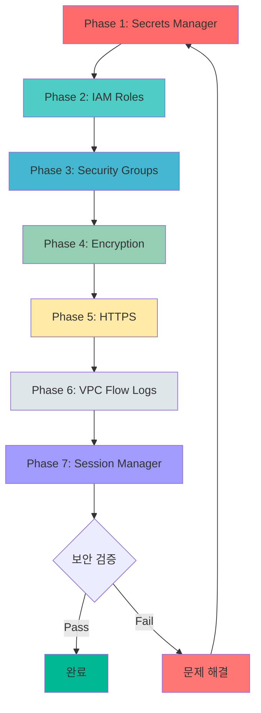
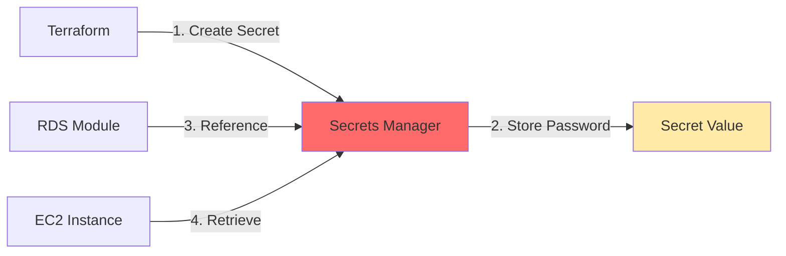
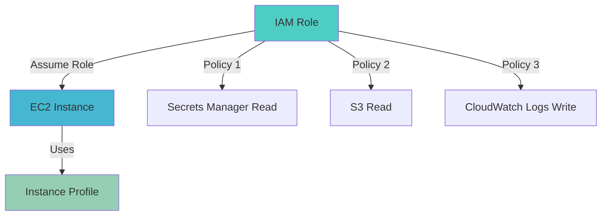
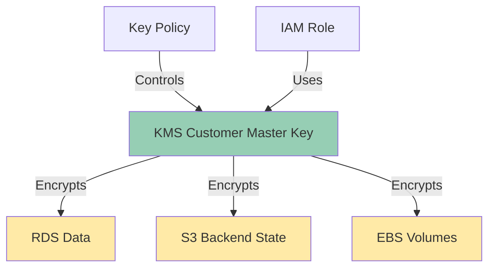
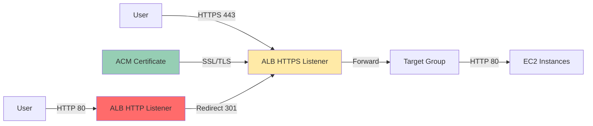
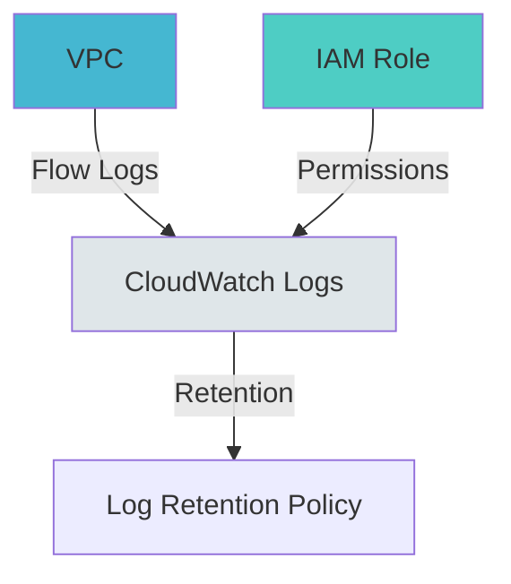
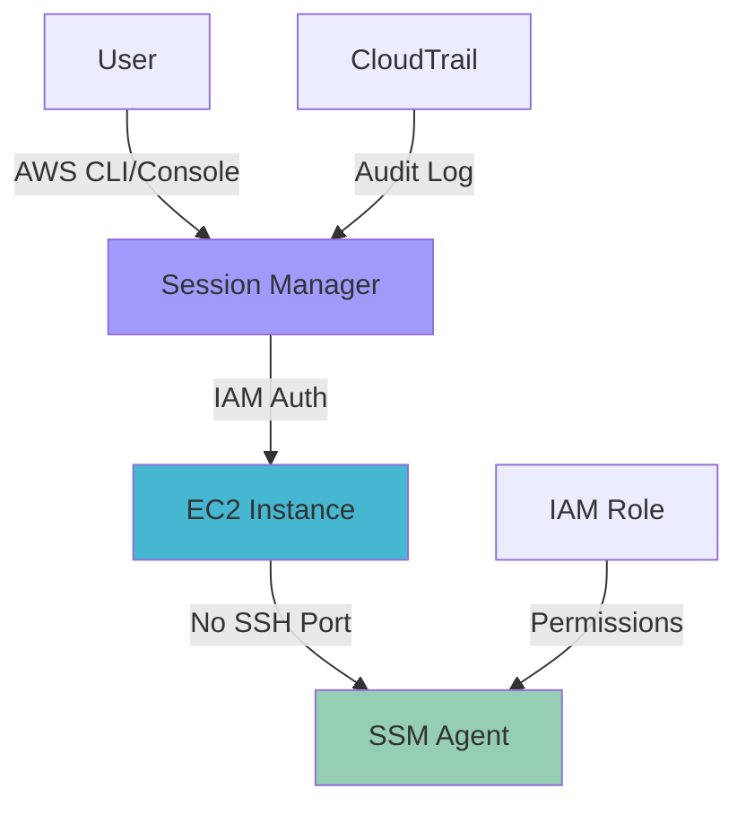

# Design: Security Hardening (보안 강화)

**작성일**: 2026-01-30
**작성자**: Claude Code
**Feature ID**: security-hardening
**PDCA Phase**: Design
**Based on**: [20260130-security-hardening.plan.md](../../01-plan/features/20260130-security-hardening.plan.md)

---

## 1. 보안 아키텍처 (Security Architecture)

### 1.1 전체 보안 강화 워크플로우



### 1.2 보안 레이어 구조

```
┌─────────────────────────────────────────────────────────────┐
│                   Security Layers                           │
└─────────────────────────────────────────────────────────────┘
                              │
        ┌─────────────────────┼─────────────────────┐
        │                     │                     │
        ▼                     ▼                     ▼
┌───────────────┐     ┌───────────────┐     ┌───────────────┐
│  Network      │     │  Identity &   │     │  Data         │
│  Security     │     │  Access       │     │  Protection   │
│               │     │               │     │               │
│ • Security    │     │ • IAM Roles   │     │ • KMS         │
│   Groups      │     │ • Instance    │     │ • RDS Encrypt │
│ • VPC Flow    │     │   Profiles    │     │ • S3 Encrypt  │
│   Logs        │     │ • Least       │     │ • Secrets     │
│ • Private     │     │   Privilege   │     │   Manager     │
│   Subnets     │     │               │     │               │
└───────────────┘     └───────────────┘     └───────────────┘
        │                     │                     │
        └─────────────────────┴─────────────────────┘
                              │
                              ▼
                    ┌─────────────────┐
                    │  Monitoring &   │
                    │  Compliance     │
                    │                 │
                    │ • CloudWatch    │
                    │ • Flow Logs     │
                    │ • Session Mgr   │
                    └─────────────────┘
```

### 1.3 환경별 보안 수준

```
┌─────────────────────────────────────────────────────────────┐
│                  Security Levels by Environment              │
└─────────────────────────────────────────────────────────────┘

Dev Environment (학습 및 개발)
├── Secrets Manager: ✅ 적용 (학습용)
├── IAM Roles: ✅ 적용 (권한 학습)
├── Security Groups: 제한적 (개발 편의성)
├── Encryption: ✅ 적용 (기본)
├── HTTPS: ⚠️ 선택적
├── VPC Flow Logs: ✅ 적용 (7일)
└── Session Manager: ⚠️ 선택적

Staging Environment (사전 검증)
├── Secrets Manager: ✅ 필수
├── IAM Roles: ✅ 필수
├── Security Groups: 엄격 (Prod 미러링)
├── Encryption: ✅ 필수 (KMS)
├── HTTPS: ✅ 필수
├── VPC Flow Logs: ✅ 필수 (14일)
└── Session Manager: ✅ 권장

Prod Environment (운영)
├── Secrets Manager: ✅ 필수 (자동 로테이션)
├── IAM Roles: ✅ 필수 (최소 권한)
├── Security Groups: 매우 엄격
├── Encryption: ✅ 필수 (KMS + 자동 로테이션)
├── HTTPS: ✅ 필수 (TLS 1.3)
├── VPC Flow Logs: ✅ 필수 (30일)
└── Session Manager: ✅ 필수
```

---

## 2. Phase별 상세 설계

### Phase 1: AWS Secrets Manager 통합

#### 2.1.1 아키텍처



#### 2.1.2 디렉토리 구조

```
modules/
└── secrets/
    ├── main.tf              # Secrets Manager 리소스
    ├── variables.tf         # 입력 변수
    ├── outputs.tf           # 시크릿 ARN 출력
    └── README.md            # 모듈 설명
```

#### 2.1.3 Secrets Manager 모듈 코드

**파일**: `modules/secrets/main.tf`

```hcl
# modules/secrets/main.tf

# RDS 마스터 비밀번호 시크릿
resource "aws_secretsmanager_secret" "db_password" {
  name_prefix = "${var.project_name}-${var.env_name}-db-password-"
  description = "RDS master password for ${var.env_name} environment"

  recovery_window_in_days = var.env_name == "prod" ? 30 : 7

  tags = merge(
    var.common_tags,
    {
      Name        = "${var.project_name}-${var.env_name}-db-password"
      Environment = var.env_name
      ManagedBy   = "Terraform"
      Rotation    = var.enable_rotation ? "enabled" : "disabled"
    }
  )
}

# 시크릿 값 저장
resource "aws_secretsmanager_secret_version" "db_password" {
  secret_id     = aws_secretsmanager_secret.db_password.id
  secret_string = jsonencode({
    username = var.db_master_username
    password = var.db_master_password
    engine   = "mysql"
    host     = var.db_endpoint
    port     = 3306
  })

  lifecycle {
    ignore_changes = [secret_string]  # Terraform이 비밀번호 변경을 무시
  }
}

# 자동 로테이션 설정 (Prod 환경)
resource "aws_secretsmanager_secret_rotation" "db_password" {
  count = var.enable_rotation ? 1 : 0

  secret_id           = aws_secretsmanager_secret.db_password.id
  rotation_lambda_arn = var.rotation_lambda_arn

  rotation_rules {
    automatically_after_days = 30
  }
}
```

**파일**: `modules/secrets/variables.tf`

```hcl
# modules/secrets/variables.tf

variable "project_name" {
  description = "Project name"
  type        = string
}

variable "env_name" {
  description = "Environment name"
  type        = string
}

variable "db_master_username" {
  description = "RDS master username"
  type        = string
  default     = "admin"
}

variable "db_master_password" {
  description = "RDS master password"
  type        = string
  sensitive   = true
}

variable "db_endpoint" {
  description = "RDS endpoint"
  type        = string
  default     = ""
}

variable "enable_rotation" {
  description = "Enable automatic password rotation"
  type        = bool
  default     = false
}

variable "rotation_lambda_arn" {
  description = "Lambda ARN for password rotation"
  type        = string
  default     = ""
}

variable "common_tags" {
  description = "Common tags"
  type        = map(string)
  default     = {}
}
```

**파일**: `modules/secrets/outputs.tf`

```hcl
# modules/secrets/outputs.tf

output "secret_arn" {
  description = "ARN of the secret"
  value       = aws_secretsmanager_secret.db_password.arn
}

output "secret_id" {
  description = "ID of the secret"
  value       = aws_secretsmanager_secret.db_password.id
}

output "secret_name" {
  description = "Name of the secret"
  value       = aws_secretsmanager_secret.db_password.name
}
```

#### 2.1.4 RDS 모듈 업데이트

**파일**: `modules/rds/main.tf` (수정)

```hcl
# modules/rds/main.tf

# Secrets Manager에서 비밀번호 조회
data "aws_secretsmanager_secret_version" "db_password" {
  count     = var.secret_arn != "" ? 1 : 0
  secret_id = var.secret_arn
}

locals {
  db_credentials = var.secret_arn != "" ? jsondecode(data.aws_secretsmanager_secret_version.db_password[0].secret_string) : null
  db_password    = local.db_credentials != null ? local.db_credentials.password : var.db_password
}

resource "aws_db_instance" "main" {
  # ... 기존 설정 ...

  username = var.db_username
  password = local.db_password  # Secrets Manager에서 가져온 비밀번호 사용

  # ... 나머지 설정 ...
}
```

**파일**: `modules/rds/variables.tf` (추가)

```hcl
# modules/rds/variables.tf

variable "secret_arn" {
  description = "ARN of Secrets Manager secret for DB password"
  type        = string
  default     = ""
}

variable "db_password" {
  description = "DB password (fallback if Secrets Manager not used)"
  type        = string
  sensitive   = true
  default     = ""
}
```

#### 2.1.5 환경별 사용 예제

**파일**: `environments/dev/main.tf` (업데이트)

```hcl
# environments/dev/main.tf

# Secrets Manager 모듈 호출
module "secrets" {
  source = "../../modules/secrets"

  project_name        = var.project_name
  env_name           = var.env_name
  db_master_username = "admin"
  db_master_password = random_password.db_password.result
  enable_rotation    = false  # Dev 환경은 로테이션 비활성화

  common_tags = local.common_tags
}

# 랜덤 비밀번호 생성
resource "random_password" "db_password" {
  length  = 16
  special = true
}

# RDS 모듈에 시크릿 전달
module "rds" {
  source = "../../modules/rds"

  # ... 기존 설정 ...

  secret_arn = module.secrets.secret_arn

  depends_on = [module.secrets]
}
```

---

### Phase 2: IAM Role 및 Instance Profile

#### 2.2.1 아키텍처



#### 2.2.2 디렉토리 구조

```
modules/
└── iam/
    ├── main.tf              # IAM Role 및 Policy
    ├── variables.tf         # 입력 변수
    ├── outputs.tf           # Role ARN 출력
    └── README.md            # 모듈 설명
```

#### 2.2.3 IAM 모듈 코드

**파일**: `modules/iam/main.tf`

```hcl
# modules/iam/main.tf

# EC2 인스턴스 Role (App 서버용)
resource "aws_iam_role" "ec2_app" {
  name = "${var.project_name}-${var.env_name}-ec2-app-role"

  assume_role_policy = jsonencode({
    Version = "2012-10-17"
    Statement = [
      {
        Action = "sts:AssumeRole"
        Effect = "Allow"
        Principal = {
          Service = "ec2.amazonaws.com"
        }
      }
    ]
  })

  tags = merge(
    var.common_tags,
    {
      Name        = "${var.project_name}-${var.env_name}-ec2-app-role"
      Environment = var.env_name
      ManagedBy   = "Terraform"
    }
  )
}

# Secrets Manager 읽기 권한
resource "aws_iam_role_policy" "secrets_read" {
  name = "secrets-manager-read"
  role = aws_iam_role.ec2_app.id

  policy = jsonencode({
    Version = "2012-10-17"
    Statement = [
      {
        Effect = "Allow"
        Action = [
          "secretsmanager:GetSecretValue",
          "secretsmanager:DescribeSecret"
        ]
        Resource = var.secrets_arns
      }
    ]
  })
}

# S3 읽기 권한 (애플리케이션 에셋)
resource "aws_iam_role_policy" "s3_read" {
  count = var.enable_s3_access ? 1 : 0
  name  = "s3-read-access"
  role  = aws_iam_role.ec2_app.id

  policy = jsonencode({
    Version = "2012-10-17"
    Statement = [
      {
        Effect = "Allow"
        Action = [
          "s3:GetObject",
          "s3:ListBucket"
        ]
        Resource = [
          "arn:aws:s3:::${var.project_name}-${var.env_name}-assets",
          "arn:aws:s3:::${var.project_name}-${var.env_name}-assets/*"
        ]
      }
    ]
  })
}

# CloudWatch Logs 쓰기 권한
resource "aws_iam_role_policy" "cloudwatch_logs" {
  name = "cloudwatch-logs-write"
  role = aws_iam_role.ec2_app.id

  policy = jsonencode({
    Version = "2012-10-17"
    Statement = [
      {
        Effect = "Allow"
        Action = [
          "logs:CreateLogGroup",
          "logs:CreateLogStream",
          "logs:PutLogEvents",
          "logs:DescribeLogStreams"
        ]
        Resource = "arn:aws:logs:*:*:*"
      }
    ]
  })
}

# Systems Manager Session Manager 권한 (선택적)
resource "aws_iam_role_policy_attachment" "ssm_managed_instance" {
  count      = var.enable_session_manager ? 1 : 0
  role       = aws_iam_role.ec2_app.name
  policy_arn = "arn:aws:iam::aws:policy/AmazonSSMManagedInstanceCore"
}

# Instance Profile 생성
resource "aws_iam_instance_profile" "ec2_app" {
  name = "${var.project_name}-${var.env_name}-ec2-app-profile"
  role = aws_iam_role.ec2_app.name

  tags = merge(
    var.common_tags,
    {
      Name        = "${var.project_name}-${var.env_name}-ec2-app-profile"
      Environment = var.env_name
    }
  )
}

# Bastion 호스트 Role (최소 권한)
resource "aws_iam_role" "ec2_bastion" {
  count = var.create_bastion_role ? 1 : 0
  name  = "${var.project_name}-${var.env_name}-ec2-bastion-role"

  assume_role_policy = jsonencode({
    Version = "2012-10-17"
    Statement = [
      {
        Action = "sts:AssumeRole"
        Effect = "Allow"
        Principal = {
          Service = "ec2.amazonaws.com"
        }
      }
    ]
  })

  tags = merge(
    var.common_tags,
    {
      Name        = "${var.project_name}-${var.env_name}-ec2-bastion-role"
      Environment = var.env_name
    }
  )
}

# Bastion Instance Profile
resource "aws_iam_instance_profile" "ec2_bastion" {
  count = var.create_bastion_role ? 1 : 0
  name  = "${var.project_name}-${var.env_name}-ec2-bastion-profile"
  role  = aws_iam_role.ec2_bastion[0].name
}
```

**파일**: `modules/iam/variables.tf`

```hcl
# modules/iam/variables.tf

variable "project_name" {
  description = "Project name"
  type        = string
}

variable "env_name" {
  description = "Environment name"
  type        = string
}

variable "secrets_arns" {
  description = "List of Secrets Manager ARNs to grant access"
  type        = list(string)
  default     = ["*"]
}

variable "enable_s3_access" {
  description = "Enable S3 read access"
  type        = bool
  default     = true
}

variable "enable_session_manager" {
  description = "Enable AWS Systems Manager Session Manager"
  type        = bool
  default     = false
}

variable "create_bastion_role" {
  description = "Create IAM role for Bastion host"
  type        = bool
  default     = true
}

variable "common_tags" {
  description = "Common tags"
  type        = map(string)
  default     = {}
}
```

**파일**: `modules/iam/outputs.tf`

```hcl
# modules/iam/outputs.tf

output "ec2_app_role_arn" {
  description = "ARN of EC2 app role"
  value       = aws_iam_role.ec2_app.arn
}

output "ec2_app_role_name" {
  description = "Name of EC2 app role"
  value       = aws_iam_role.ec2_app.name
}

output "ec2_app_instance_profile_arn" {
  description = "ARN of EC2 app instance profile"
  value       = aws_iam_instance_profile.ec2_app.arn
}

output "ec2_app_instance_profile_name" {
  description = "Name of EC2 app instance profile"
  value       = aws_iam_instance_profile.ec2_app.name
}

output "ec2_bastion_instance_profile_name" {
  description = "Name of EC2 bastion instance profile"
  value       = var.create_bastion_role ? aws_iam_instance_profile.ec2_bastion[0].name : ""
}
```

#### 2.2.4 Compute 모듈 업데이트

**파일**: `modules/compute/main.tf` (수정)

```hcl
# modules/compute/main.tf

# Launch Template에 Instance Profile 추가
resource "aws_launch_template" "app" {
  # ... 기존 설정 ...

  iam_instance_profile {
    name = var.instance_profile_name  # IAM 모듈에서 전달받은 Instance Profile
  }

  # ... 나머지 설정 ...
}

# Bastion 인스턴스에 Instance Profile 추가
resource "aws_instance" "bastion" {
  count = var.enable_bastion ? 1 : 0

  # ... 기존 설정 ...

  iam_instance_profile = var.bastion_instance_profile_name

  # ... 나머지 설정 ...
}
```

---

### Phase 3: Security Group 최적화

#### 2.3.1 보안 그룹 규칙 비교

**현재 상태 (취약)**:
```
Bastion SG:
  Ingress: SSH (22) from 0.0.0.0/0  ❌ 위험

App SG:
  Ingress: HTTP (80) from ALB SG
  Ingress: SSH (22) from Bastion SG

ALB SG:
  Ingress: HTTP (80) from 0.0.0.0/0

RDS SG:
  Ingress: MySQL (3306) from App SG
```

**개선 후 (안전)**:
```
Bastion SG:
  Ingress: SSH (22) from [관리자 IP 목록]  ✅ 제한적

App SG:
  Ingress: HTTP (80) from ALB SG only
  Ingress: SSH (22) from Bastion SG only

ALB SG:
  Ingress: HTTP (80) from 0.0.0.0/0
  Ingress: HTTPS (443) from 0.0.0.0/0

RDS SG:
  Ingress: MySQL (3306) from App SG only
```

#### 2.3.2 Security Groups 모듈 업데이트

**파일**: `modules/security_groups/main.tf` (수정)

```hcl
# modules/security_groups/main.tf

# Bastion Security Group
resource "aws_security_group" "bastion" {
  name        = "${var.project_name}-${var.env_name}-bastion-sg"
  description = "Security group for Bastion host"
  vpc_id      = var.vpc_id

  # SSH 접근을 관리자 IP로 제한
  dynamic "ingress" {
    for_each = var.admin_ip_ranges
    content {
      description = "SSH from admin IP ${ingress.value}"
      from_port   = 22
      to_port     = 22
      protocol    = "tcp"
      cidr_blocks = [ingress.value]
    }
  }

  egress {
    description = "Allow all outbound"
    from_port   = 0
    to_port     = 0
    protocol    = "-1"
    cidr_blocks = ["0.0.0.0/0"]
  }

  tags = merge(
    var.common_tags,
    {
      Name        = "${var.project_name}-${var.env_name}-bastion-sg"
      Environment = var.env_name
    }
  )
}

# App Security Group
resource "aws_security_group" "app" {
  name        = "${var.project_name}-${var.env_name}-app-sg"
  description = "Security group for App instances"
  vpc_id      = var.vpc_id

  # HTTP from ALB only
  ingress {
    description     = "HTTP from ALB"
    from_port       = 80
    to_port         = 80
    protocol        = "tcp"
    security_groups = [aws_security_group.alb.id]
  }

  # SSH from Bastion only
  ingress {
    description     = "SSH from Bastion"
    from_port       = 22
    to_port         = 22
    protocol        = "tcp"
    security_groups = [aws_security_group.bastion.id]
  }

  egress {
    description = "Allow all outbound"
    from_port   = 0
    to_port     = 0
    protocol    = "-1"
    cidr_blocks = ["0.0.0.0/0"]
  }

  tags = merge(
    var.common_tags,
    {
      Name        = "${var.project_name}-${var.env_name}-app-sg"
      Environment = var.env_name
    }
  )
}

# ALB Security Group
resource "aws_security_group" "alb" {
  name        = "${var.project_name}-${var.env_name}-alb-sg"
  description = "Security group for ALB"
  vpc_id      = var.vpc_id

  # HTTP from anywhere
  ingress {
    description = "HTTP from anywhere"
    from_port   = 80
    to_port     = 80
    protocol    = "tcp"
    cidr_blocks = ["0.0.0.0/0"]
  }

  # HTTPS from anywhere
  ingress {
    description = "HTTPS from anywhere"
    from_port   = 443
    to_port     = 443
    protocol    = "tcp"
    cidr_blocks = ["0.0.0.0/0"]
  }

  egress {
    description = "Allow all outbound"
    from_port   = 0
    to_port     = 0
    protocol    = "-1"
    cidr_blocks = ["0.0.0.0/0"]
  }

  tags = merge(
    var.common_tags,
    {
      Name        = "${var.project_name}-${var.env_name}-alb-sg"
      Environment = var.env_name
    }
  )
}

# RDS Security Group
resource "aws_security_group" "rds" {
  name        = "${var.project_name}-${var.env_name}-rds-sg"
  description = "Security group for RDS"
  vpc_id      = var.vpc_id

  # MySQL from App instances only
  ingress {
    description     = "MySQL from App"
    from_port       = 3306
    to_port         = 3306
    protocol        = "tcp"
    security_groups = [aws_security_group.app.id]
  }

  egress {
    description = "Allow all outbound"
    from_port   = 0
    to_port     = 0
    protocol    = "-1"
    cidr_blocks = ["0.0.0.0/0"]
  }

  tags = merge(
    var.common_tags,
    {
      Name        = "${var.project_name}-${var.env_name}-rds-sg"
      Environment = var.env_name
    }
  )
}
```

**파일**: `modules/security_groups/variables.tf` (추가)

```hcl
# modules/security_groups/variables.tf

variable "admin_ip_ranges" {
  description = "List of admin IP ranges for SSH access to Bastion"
  type        = list(string)
  default     = []

  validation {
    condition     = length(var.admin_ip_ranges) > 0
    error_message = "At least one admin IP range must be specified for security."
  }
}
```

#### 2.3.3 환경별 관리자 IP 설정

**파일**: `environments/dev/terraform.tfvars` (추가)

```hcl
# environments/dev/terraform.tfvars

# Admin IP ranges for SSH access (개발자 IP로 변경 필요)
admin_ip_ranges = [
  "203.0.113.0/32",    # 개발자 1 IP
  "198.51.100.0/32",   # 개발자 2 IP
]
```

**파일**: `environments/prod/terraform.tfvars` (추가)

```hcl
# environments/prod/terraform.tfvars

# Admin IP ranges for SSH access (매우 제한적)
admin_ip_ranges = [
  "203.0.113.10/32",   # 운영팀 IP만
]
```

---

### Phase 4: 데이터 암호화 (RDS, S3, KMS)

#### 2.4.1 암호화 아키텍처



#### 2.4.2 디렉토리 구조

```
modules/
└── kms/
    ├── main.tf              # KMS Key 생성
    ├── variables.tf         # 입력 변수
    ├── outputs.tf           # Key ARN 출력
    └── README.md            # 모듈 설명
```

#### 2.4.3 KMS 모듈 코드

**파일**: `modules/kms/main.tf`

```hcl
# modules/kms/main.tf

# RDS 암호화용 KMS Key
resource "aws_kms_key" "rds" {
  description             = "${var.project_name} ${var.env_name} RDS encryption key"
  deletion_window_in_days = var.deletion_window_in_days
  enable_key_rotation     = var.enable_key_rotation

  tags = merge(
    var.common_tags,
    {
      Name        = "${var.project_name}-${var.env_name}-rds-key"
      Environment = var.env_name
      Purpose     = "RDS Encryption"
    }
  )
}

resource "aws_kms_alias" "rds" {
  name          = "alias/${var.project_name}-${var.env_name}-rds"
  target_key_id = aws_kms_key.rds.key_id
}

# S3 Backend 암호화용 KMS Key
resource "aws_kms_key" "s3" {
  description             = "${var.project_name} ${var.env_name} S3 encryption key"
  deletion_window_in_days = var.deletion_window_in_days
  enable_key_rotation     = var.enable_key_rotation

  tags = merge(
    var.common_tags,
    {
      Name        = "${var.project_name}-${var.env_name}-s3-key"
      Environment = var.env_name
      Purpose     = "S3 Encryption"
    }
  )
}

resource "aws_kms_alias" "s3" {
  name          = "alias/${var.project_name}-${var.env_name}-s3"
  target_key_id = aws_kms_key.s3.key_id
}

# EBS 볼륨 암호화용 KMS Key (선택적)
resource "aws_kms_key" "ebs" {
  count = var.create_ebs_key ? 1 : 0

  description             = "${var.project_name} ${var.env_name} EBS encryption key"
  deletion_window_in_days = var.deletion_window_in_days
  enable_key_rotation     = var.enable_key_rotation

  tags = merge(
    var.common_tags,
    {
      Name        = "${var.project_name}-${var.env_name}-ebs-key"
      Environment = var.env_name
      Purpose     = "EBS Encryption"
    }
  )
}

resource "aws_kms_alias" "ebs" {
  count = var.create_ebs_key ? 1 : 0

  name          = "alias/${var.project_name}-${var.env_name}-ebs"
  target_key_id = aws_kms_key.ebs[0].key_id
}
```

**파일**: `modules/kms/variables.tf`

```hcl
# modules/kms/variables.tf

variable "project_name" {
  description = "Project name"
  type        = string
}

variable "env_name" {
  description = "Environment name"
  type        = string
}

variable "deletion_window_in_days" {
  description = "KMS key deletion window in days"
  type        = number
  default     = 30

  validation {
    condition     = var.deletion_window_in_days >= 7 && var.deletion_window_in_days <= 30
    error_message = "Deletion window must be between 7 and 30 days."
  }
}

variable "enable_key_rotation" {
  description = "Enable automatic key rotation"
  type        = bool
  default     = true
}

variable "create_ebs_key" {
  description = "Create KMS key for EBS encryption"
  type        = bool
  default     = false
}

variable "common_tags" {
  description = "Common tags"
  type        = map(string)
  default     = {}
}
```

**파일**: `modules/kms/outputs.tf`

```hcl
# modules/kms/outputs.tf

output "rds_key_arn" {
  description = "ARN of RDS KMS key"
  value       = aws_kms_key.rds.arn
}

output "rds_key_id" {
  description = "ID of RDS KMS key"
  value       = aws_kms_key.rds.id
}

output "s3_key_arn" {
  description = "ARN of S3 KMS key"
  value       = aws_kms_key.s3.arn
}

output "s3_key_id" {
  description = "ID of S3 KMS key"
  value       = aws_kms_key.s3.id
}

output "ebs_key_arn" {
  description = "ARN of EBS KMS key"
  value       = var.create_ebs_key ? aws_kms_key.ebs[0].arn : ""
}
```

#### 2.4.4 RDS 모듈에 암호화 적용

**파일**: `modules/rds/main.tf` (수정)

```hcl
# modules/rds/main.tf

resource "aws_db_instance" "main" {
  # ... 기존 설정 ...

  # 저장 시 암호화 활성화
  storage_encrypted = true
  kms_key_id        = var.kms_key_arn

  # ... 나머지 설정 ...

  tags = merge(
    var.common_tags,
    {
      Encryption = "Enabled"
      KMSKey     = var.kms_key_arn != "" ? "Custom" : "AWS Managed"
    }
  )
}
```

**파일**: `modules/rds/variables.tf` (추가)

```hcl
# modules/rds/variables.tf

variable "kms_key_arn" {
  description = "ARN of KMS key for RDS encryption"
  type        = string
  default     = ""
}
```

#### 2.4.5 S3 Backend 암호화 스크립트

**파일**: `scripts/enable-s3-encryption.ps1` (새 파일)

```powershell
# scripts/enable-s3-encryption.ps1

param(
    [Parameter(Mandatory=$true)]
    [ValidateSet("dev", "staging", "prod")]
    [string]$Environment,

    [Parameter(Mandatory=$true)]
    [string]$KmsKeyId
)

$BucketName = "tfstate-$Environment"

Write-Host "━━━━━━━━━━━━━━━━━━━━━━━━━━━━━━━━━━━━━━━━" -ForegroundColor Cyan
Write-Host "  S3 Backend Encryption Setup" -ForegroundColor Cyan
Write-Host "━━━━━━━━━━━━━━━━━━━━━━━━━━━━━━━━━━━━━━━━" -ForegroundColor Cyan
Write-Host ""

Write-Host "Environment: $Environment" -ForegroundColor Yellow
Write-Host "Bucket: $BucketName" -ForegroundColor Yellow
Write-Host "KMS Key ID: $KmsKeyId" -ForegroundColor Yellow
Write-Host ""

# S3 버킷 암호화 설정
Write-Host "⏳ Enabling S3 bucket encryption..." -ForegroundColor Blue

$EncryptionConfig = @"
{
  "Rules": [
    {
      "ApplyServerSideEncryptionByDefault": {
        "SSEAlgorithm": "aws:kms",
        "KMSMasterKeyID": "$KmsKeyId"
      },
      "BucketKeyEnabled": true
    }
  ]
}
"@

aws s3api put-bucket-encryption `
    --bucket $BucketName `
    --server-side-encryption-configuration $EncryptionConfig `
    --endpoint-url http://localhost:4566

if ($LASTEXITCODE -eq 0) {
    Write-Host "✅ S3 bucket encryption enabled successfully" -ForegroundColor Green
} else {
    Write-Host "❌ Failed to enable S3 bucket encryption" -ForegroundColor Red
    exit 1
}

# 검증
Write-Host ""
Write-Host "⏳ Verifying encryption configuration..." -ForegroundColor Blue

aws s3api get-bucket-encryption `
    --bucket $BucketName `
    --endpoint-url http://localhost:4566

Write-Host ""
Write-Host "━━━━━━━━━━━━━━━━━━━━━━━━━━━━━━━━━━━━━━━━" -ForegroundColor Cyan
Write-Host "  Encryption setup completed!" -ForegroundColor Green
Write-Host "━━━━━━━━━━━━━━━━━━━━━━━━━━━━━━━━━━━━━━━━" -ForegroundColor Cyan
```

---

### Phase 5: HTTPS 설정 (ALB)

#### 2.5.1 HTTPS 아키텍처



#### 2.5.2 ACM 인증서 모듈

**파일**: `modules/acm/main.tf` (새 파일)

```hcl
# modules/acm/main.tf

# ACM 인증서 요청
resource "aws_acm_certificate" "main" {
  count = var.create_certificate ? 1 : 0

  domain_name       = var.domain_name
  validation_method = "DNS"

  subject_alternative_names = var.subject_alternative_names

  lifecycle {
    create_before_destroy = true
  }

  tags = merge(
    var.common_tags,
    {
      Name        = "${var.project_name}-${var.env_name}-cert"
      Environment = var.env_name
    }
  )
}

# DNS 검증 레코드 (Route53 사용 시)
resource "aws_route53_record" "cert_validation" {
  for_each = var.create_certificate && var.route53_zone_id != "" ? {
    for dvo in aws_acm_certificate.main[0].domain_validation_options : dvo.domain_name => {
      name   = dvo.resource_record_name
      record = dvo.resource_record_value
      type   = dvo.resource_record_type
    }
  } : {}

  allow_overwrite = true
  name            = each.value.name
  records         = [each.value.record]
  ttl             = 60
  type            = each.value.type
  zone_id         = var.route53_zone_id
}

# 인증서 검증 완료 대기
resource "aws_acm_certificate_validation" "main" {
  count = var.create_certificate && var.route53_zone_id != "" ? 1 : 0

  certificate_arn         = aws_acm_certificate.main[0].arn
  validation_record_fqdns = [for record in aws_route53_record.cert_validation : record.fqdn]
}
```

**파일**: `modules/acm/variables.tf`

```hcl
# modules/acm/variables.tf

variable "project_name" {
  description = "Project name"
  type        = string
}

variable "env_name" {
  description = "Environment name"
  type        = string
}

variable "create_certificate" {
  description = "Create ACM certificate"
  type        = bool
  default     = false
}

variable "domain_name" {
  description = "Domain name for certificate"
  type        = string
  default     = ""
}

variable "subject_alternative_names" {
  description = "Additional domain names"
  type        = list(string)
  default     = []
}

variable "route53_zone_id" {
  description = "Route53 zone ID for DNS validation"
  type        = string
  default     = ""
}

variable "common_tags" {
  description = "Common tags"
  type        = map(string)
  default     = {}
}
```

#### 2.5.3 ALB 모듈에 HTTPS 리스너 추가

**파일**: `modules/alb/main.tf` (수정)

```hcl
# modules/alb/main.tf

# HTTPS 리스너
resource "aws_lb_listener" "https" {
  count = var.certificate_arn != "" ? 1 : 0

  load_balancer_arn = aws_lb.main.arn
  port              = "443"
  protocol          = "HTTPS"
  ssl_policy        = var.ssl_policy
  certificate_arn   = var.certificate_arn

  default_action {
    type             = "forward"
    target_group_arn = aws_lb_target_group.app.arn
  }

  tags = merge(
    var.common_tags,
    {
      Protocol = "HTTPS"
    }
  )
}

# HTTP 리스너 (HTTPS로 리다이렉트)
resource "aws_lb_listener" "http" {
  load_balancer_arn = aws_lb.main.arn
  port              = "80"
  protocol          = "HTTP"

  default_action {
    type = var.certificate_arn != "" ? "redirect" : "forward"

    # HTTPS로 리다이렉트
    dynamic "redirect" {
      for_each = var.certificate_arn != "" ? [1] : []
      content {
        port        = "443"
        protocol    = "HTTPS"
        status_code = "HTTP_301"
      }
    }

    # HTTPS 없으면 직접 포워딩
    target_group_arn = var.certificate_arn == "" ? aws_lb_target_group.app.arn : null
  }

  tags = var.common_tags
}
```

**파일**: `modules/alb/variables.tf` (추가)

```hcl
# modules/alb/variables.tf

variable "certificate_arn" {
  description = "ARN of ACM certificate for HTTPS"
  type        = string
  default     = ""
}

variable "ssl_policy" {
  description = "SSL policy for HTTPS listener"
  type        = string
  default     = "ELBSecurityPolicy-TLS13-1-2-2021-06"
}
```

---

### Phase 6: VPC Flow Logs

#### 2.6.1 VPC Flow Logs 아키텍처



#### 2.6.2 VPC 모듈에 Flow Logs 추가

**파일**: `modules/vpc/main.tf` (추가)

```hcl
# modules/vpc/main.tf

# CloudWatch Logs Group for VPC Flow Logs
resource "aws_cloudwatch_log_group" "vpc_flow_logs" {
  count = var.enable_flow_logs ? 1 : 0

  name              = "/aws/vpc/${var.project_name}-${var.env_name}"
  retention_in_days = var.flow_logs_retention_days

  tags = merge(
    var.common_tags,
    {
      Name        = "${var.project_name}-${var.env_name}-vpc-flow-logs"
      Environment = var.env_name
    }
  )
}

# IAM Role for VPC Flow Logs
resource "aws_iam_role" "vpc_flow_logs" {
  count = var.enable_flow_logs ? 1 : 0

  name = "${var.project_name}-${var.env_name}-vpc-flow-logs-role"

  assume_role_policy = jsonencode({
    Version = "2012-10-17"
    Statement = [
      {
        Action = "sts:AssumeRole"
        Effect = "Allow"
        Principal = {
          Service = "vpc-flow-logs.amazonaws.com"
        }
      }
    ]
  })

  tags = merge(
    var.common_tags,
    {
      Name = "${var.project_name}-${var.env_name}-vpc-flow-logs-role"
    }
  )
}

# IAM Policy for VPC Flow Logs
resource "aws_iam_role_policy" "vpc_flow_logs" {
  count = var.enable_flow_logs ? 1 : 0

  name = "vpc-flow-logs-policy"
  role = aws_iam_role.vpc_flow_logs[0].id

  policy = jsonencode({
    Version = "2012-10-17"
    Statement = [
      {
        Action = [
          "logs:CreateLogGroup",
          "logs:CreateLogStream",
          "logs:PutLogEvents",
          "logs:DescribeLogGroups",
          "logs:DescribeLogStreams"
        ]
        Effect   = "Allow"
        Resource = "*"
      }
    ]
  })
}

# VPC Flow Logs
resource "aws_flow_log" "main" {
  count = var.enable_flow_logs ? 1 : 0

  iam_role_arn    = aws_iam_role.vpc_flow_logs[0].arn
  log_destination = aws_cloudwatch_log_group.vpc_flow_logs[0].arn
  traffic_type    = var.flow_logs_traffic_type
  vpc_id          = aws_vpc.main.id

  tags = merge(
    var.common_tags,
    {
      Name        = "${var.project_name}-${var.env_name}-vpc-flow-log"
      Environment = var.env_name
    }
  )
}
```

**파일**: `modules/vpc/variables.tf` (추가)

```hcl
# modules/vpc/variables.tf

variable "enable_flow_logs" {
  description = "Enable VPC Flow Logs"
  type        = bool
  default     = true
}

variable "flow_logs_retention_days" {
  description = "CloudWatch Logs retention in days"
  type        = number
  default     = 7

  validation {
    condition = contains([
      1, 3, 5, 7, 14, 30, 60, 90, 120, 150, 180, 365, 400, 545, 731, 1827, 3653
    ], var.flow_logs_retention_days)
    error_message = "Invalid retention days. Must be one of AWS allowed values."
  }
}

variable "flow_logs_traffic_type" {
  description = "Type of traffic to log (ALL, ACCEPT, REJECT)"
  type        = string
  default     = "ALL"

  validation {
    condition     = contains(["ALL", "ACCEPT", "REJECT"], var.flow_logs_traffic_type)
    error_message = "Traffic type must be ALL, ACCEPT, or REJECT."
  }
}
```

#### 2.6.3 환경별 Flow Logs 설정

**파일**: `environments/dev/terraform.tfvars` (추가)

```hcl
# environments/dev/terraform.tfvars

# VPC Flow Logs 설정
enable_flow_logs         = true
flow_logs_retention_days = 7
flow_logs_traffic_type   = "ALL"
```

**파일**: `environments/prod/terraform.tfvars` (추가)

```hcl
# environments/prod/terraform.tfvars

# VPC Flow Logs 설정
enable_flow_logs         = true
flow_logs_retention_days = 30
flow_logs_traffic_type   = "ALL"
```

---

### Phase 7: Systems Manager Session Manager

#### 2.7.1 Session Manager 아키텍처



#### 2.7.2 Session Manager 활성화

**이미 Phase 2 IAM 모듈에 포함됨**:

```hcl
# modules/iam/main.tf (기존 코드)

# Systems Manager Session Manager 권한
resource "aws_iam_role_policy_attachment" "ssm_managed_instance" {
  count      = var.enable_session_manager ? 1 : 0
  role       = aws_iam_role.ec2_app.name
  policy_arn = "arn:aws:iam::aws:policy/AmazonSSMManagedInstanceCore"
}
```

#### 2.7.3 Bastion 호스트 대체 옵션

**옵션 1: Bastion 유지 + Session Manager 병행**
- Security Group에서 SSH 포트(22) 유지
- Session Manager를 주 접근 방법으로 사용
- SSH는 비상시 백업

**옵션 2: Bastion 제거 + Session Manager 전용** (권장)
- Bastion 인스턴스 완전 제거
- Security Group에서 SSH 포트(22) 제거
- 비용 절감 (~$10/월)
- 보안 향상 (SSH 포트 노출 없음)

#### 2.7.4 Session Manager 사용 예제

**PowerShell 스크립트**: `scripts/connect-session.ps1`

```powershell
# scripts/connect-session.ps1

param(
    [Parameter(Mandatory=$true)]
    [ValidateSet("dev", "staging", "prod")]
    [string]$Environment,

    [Parameter(Mandatory=$true)]
    [string]$InstanceId
)

Write-Host "━━━━━━━━━━━━━━━━━━━━━━━━━━━━━━━━━━━━━━━━" -ForegroundColor Cyan
Write-Host "  Session Manager Connection" -ForegroundColor Cyan
Write-Host "━━━━━━━━━━━━━━━━━━━━━━━━━━━━━━━━━━━━━━━━" -ForegroundColor Cyan
Write-Host ""

Write-Host "Environment: $Environment" -ForegroundColor Yellow
Write-Host "Instance ID: $InstanceId" -ForegroundColor Yellow
Write-Host ""

# Session Manager 연결
Write-Host "⏳ Connecting to instance via Session Manager..." -ForegroundColor Blue

aws ssm start-session --target $InstanceId

if ($LASTEXITCODE -eq 0) {
    Write-Host "✅ Session closed successfully" -ForegroundColor Green
} else {
    Write-Host "❌ Failed to connect to instance" -ForegroundColor Red
    exit 1
}
```

---

## 3. 통합 배포 절차

### 3.1 배포 순서

```
Phase 1: Secrets Manager (30분)
  ├─ modules/secrets/ 모듈 생성
  ├─ environments/*/main.tf 업데이트
  └─ terraform apply

Phase 2: IAM Roles (40분)
  ├─ modules/iam/ 모듈 생성
  ├─ modules/compute/ 업데이트 (Instance Profile)
  └─ terraform apply

Phase 3: Security Groups (20분)
  ├─ modules/security_groups/ 업데이트
  ├─ admin_ip_ranges 변수 추가
  └─ terraform apply

Phase 4: Encryption (40분)
  ├─ modules/kms/ 모듈 생성
  ├─ modules/rds/ 업데이트 (암호화)
  ├─ S3 Backend 암호화 스크립트 실행
  └─ terraform apply

Phase 5: HTTPS (30분, 선택적)
  ├─ modules/acm/ 모듈 생성
  ├─ modules/alb/ 업데이트 (HTTPS 리스너)
  └─ terraform apply

Phase 6: VPC Flow Logs (25분)
  ├─ modules/vpc/ 업데이트 (Flow Logs)
  └─ terraform apply

Phase 7: Session Manager (30분, 선택적)
  ├─ IAM Role 업데이트 (SSM 권한)
  ├─ Bastion 제거 여부 결정
  └─ terraform apply
```

### 3.2 환경별 적용 전략

**Dev 환경**:
```bash
cd environments/dev

# Phase 1-7 순차 적용
terraform init
terraform plan
terraform apply -auto-approve

# 검증
terraform output
```

**Staging 환경**:
```bash
cd environments/staging

# Dev에서 검증된 설정 적용
terraform init
terraform plan
terraform apply  # 수동 승인 필요

# 검증
terraform output
```

**Prod 환경**:
```bash
cd environments/prod

# 최종 검토 후 적용
terraform init
terraform plan > plan.txt  # 변경사항 검토

# 승인 후 적용
terraform apply

# 검증
terraform output
```

---

## 4. 검증 및 테스트

### 4.1 보안 검증 체크리스트

```yaml
Phase 1 - Secrets Manager:
  - [ ] 시크릿 생성 확인
  - [ ] RDS가 시크릿 참조 확인
  - [ ] terraform.tfvars에 평문 비밀번호 없음 확인

Phase 2 - IAM Roles:
  - [ ] IAM Role 생성 확인
  - [ ] Instance Profile 연결 확인
  - [ ] EC2가 Secrets Manager 접근 가능 확인
  - [ ] CloudWatch Logs 쓰기 가능 확인

Phase 3 - Security Groups:
  - [ ] Bastion SG SSH 접근 제한 확인
  - [ ] App SG ALB에서만 트래픽 수신 확인
  - [ ] RDS SG App에서만 접근 확인
  - [ ] 불필요한 0.0.0.0/0 규칙 없음 확인

Phase 4 - Encryption:
  - [ ] RDS 암호화 활성화 확인
  - [ ] S3 Backend 암호화 확인
  - [ ] KMS Key 생성 확인

Phase 5 - HTTPS:
  - [ ] ACM 인증서 발급 확인
  - [ ] ALB HTTPS 리스너 동작 확인
  - [ ] HTTP → HTTPS 리다이렉트 확인

Phase 6 - VPC Flow Logs:
  - [ ] Flow Logs 활성화 확인
  - [ ] CloudWatch Logs에 로그 수집 확인
  - [ ] 보존 기간 설정 확인

Phase 7 - Session Manager:
  - [ ] SSM Agent 실행 확인
  - [ ] Session Manager 연결 테스트
  - [ ] Bastion 제거 확인 (옵션 2 선택 시)
```

### 4.2 자동화 검증 스크립트

**파일**: `scripts/validate-security.ps1` (새 파일)

```powershell
# scripts/validate-security.ps1

param(
    [Parameter(Mandatory=$true)]
    [ValidateSet("dev", "staging", "prod")]
    [string]$Environment
)

$ErrorCount = 0

Write-Host "━━━━━━━━━━━━━━━━━━━━━━━━━━━━━━━━━━━━━━━━" -ForegroundColor Cyan
Write-Host "  Security Validation - $Environment" -ForegroundColor Cyan
Write-Host "━━━━━━━━━━━━━━━━━━━━━━━━━━━━━━━━━━━━━━━━" -ForegroundColor Cyan
Write-Host ""

# 1. Secrets Manager 확인
Write-Host "⏳ Checking Secrets Manager..." -ForegroundColor Blue
$Secrets = aws secretsmanager list-secrets --endpoint-url http://localhost:4566 | ConvertFrom-Json
if ($Secrets.SecretList.Count -gt 0) {
    Write-Host "✅ Secrets Manager: $($Secrets.SecretList.Count) secrets found" -ForegroundColor Green
} else {
    Write-Host "❌ Secrets Manager: No secrets found" -ForegroundColor Red
    $ErrorCount++
}

# 2. IAM Roles 확인
Write-Host "⏳ Checking IAM Roles..." -ForegroundColor Blue
cd "environments/$Environment"
$Outputs = terraform output -json | ConvertFrom-Json
if ($Outputs.ec2_app_instance_profile_name) {
    Write-Host "✅ IAM Role: Instance profile configured" -ForegroundColor Green
} else {
    Write-Host "❌ IAM Role: No instance profile found" -ForegroundColor Red
    $ErrorCount++
}

# 3. Security Groups 확인
Write-Host "⏳ Checking Security Groups..." -ForegroundColor Blue
# (Security Group 검증 로직)

# 4. RDS 암호화 확인
Write-Host "⏳ Checking RDS Encryption..." -ForegroundColor Blue
# (RDS 암호화 검증 로직)

# 5. VPC Flow Logs 확인
Write-Host "⏳ Checking VPC Flow Logs..." -ForegroundColor Blue
# (Flow Logs 검증 로직)

Write-Host ""
Write-Host "━━━━━━━━━━━━━━━━━━━━━━━━━━━━━━━━━━━━━━━━" -ForegroundColor Cyan
if ($ErrorCount -eq 0) {
    Write-Host "  ✅ All security checks passed!" -ForegroundColor Green
} else {
    Write-Host "  ❌ $ErrorCount security checks failed" -ForegroundColor Red
    exit 1
}
Write-Host "━━━━━━━━━━━━━━━━━━━━━━━━━━━━━━━━━━━━━━━━" -ForegroundColor Cyan
```

---

## 5. 롤백 계획

### 5.1 Phase별 롤백 절차

**Phase 1 (Secrets Manager) 롤백**:
```bash
# 1. RDS 모듈에서 시크릿 참조 제거
# 2. Secrets 모듈 제거
terraform destroy -target=module.secrets

# 3. terraform.tfvars에 평문 비밀번호 복원
```

**Phase 2 (IAM Roles) 롤백**:
```bash
# 1. Compute 모듈에서 Instance Profile 제거
# 2. IAM 모듈 제거
terraform destroy -target=module.iam
```

**Phase 3 (Security Groups) 롤백**:
```bash
# 1. Security Groups 모듈을 이전 버전으로 복원
git checkout HEAD~1 -- modules/security_groups/

# 2. 적용
terraform apply
```

**Phase 4 (Encryption) 롤백**:
```bash
# 경고: RDS 암호화 해제는 재생성 필요
# 1. KMS 모듈 제거
terraform destroy -target=module.kms

# 2. RDS 재생성 (암호화 없이)
terraform destroy -target=module.rds
terraform apply -target=module.rds
```

**Phase 5-7 롤백**: 각 Phase별 모듈 제거

---

## 6. 참고 자료

### 6.1 Terraform 리소스 문서

- [aws_secretsmanager_secret](https://registry.terraform.io/providers/hashicorp/aws/latest/docs/resources/secretsmanager_secret)
- [aws_iam_role](https://registry.terraform.io/providers/hashicorp/aws/latest/docs/resources/iam_role)
- [aws_iam_instance_profile](https://registry.terraform.io/providers/hashicorp/aws/latest/docs/resources/iam_instance_profile)
- [aws_security_group](https://registry.terraform.io/providers/hashicorp/aws/latest/docs/resources/security_group)
- [aws_kms_key](https://registry.terraform.io/providers/hashicorp/aws/latest/docs/resources/kms_key)
- [aws_db_instance](https://registry.terraform.io/providers/hashicorp/aws/latest/docs/resources/db_instance) (encryption)
- [aws_acm_certificate](https://registry.terraform.io/providers/hashicorp/aws/latest/docs/resources/acm_certificate)
- [aws_lb_listener](https://registry.terraform.io/providers/hashicorp/aws/latest/docs/resources/lb_listener)
- [aws_flow_log](https://registry.terraform.io/providers/hashicorp/aws/latest/docs/resources/flow_log)

### 6.2 AWS 보안 가이드

- [AWS Security Best Practices](https://docs.aws.amazon.com/security/)
- [IAM Best Practices](https://docs.aws.amazon.com/IAM/latest/UserGuide/best-practices.html)
- [VPC Security Best Practices](https://docs.aws.amazon.com/vpc/latest/userguide/vpc-security-best-practices.html)
- [AWS KMS Best Practices](https://docs.aws.amazon.com/kms/latest/developerguide/best-practices.html)

### 6.3 내부 문서

- [Plan - Security Hardening](../../01-plan/features/20260130-security-hardening.plan.md)
- [Design - Multi-Environment Setup](20260130-multi-environment-setup.design.md)

---

## 7. 변경 이력

| 날짜 | 버전 | 변경 내용 | 작성자 |
|------|------|-----------|--------|
| 2026-01-30 | 1.0 | 초안 작성 - Security Hardening 상세 설계 | Claude Code |

---

**다음 문서**: [Implementation - Security Hardening] (Do Phase)
**이전 문서**: [Plan - Security Hardening](../../01-plan/features/20260130-security-hardening.plan.md)
